# OpenApe Pods · Benutzerhandbuch

[English](handbook.md)

Deine Pods, ihre Skripte und die Belege, die sie bewahren.

Erstellt aus handbook.de.json. Abbildungen zeigen die gepackte App mit synthetischen Daten.

## Hier beginnen

Wählen Sie einen Pod in der Seitenleiste und nutzen Sie Übersicht, Chat, Skript, Variablen und Geheimnisse, Berechtigungen, Einstellungen und Historie. Ziehen Sie den Trenner oder verwenden Sie nach dessen Fokussierung Links/Rechts zum Verbreitern. Der Pfeil klappt die Seitenleiste ein; ihre Breite wird auf diesem Mac gespeichert.

Dieses Handbuch beschreibt die unsignierte Entwicklungsversion 0.1.0. Die Abbildungen zeigen synthetische Aufträge und lokale Referenzdateien. Echte Anmeldungen bei ChatGPT, OpenApe und Microsoft, Live-Mail-Zugriffe und die signierte Distribution benötigen noch eine Freigabeprüfung. Die Ausführung erfordert derzeit Apple Silicon und Darwin 25.6.0, geprüft unter macOS 26.6.2. Ein nicht unterstützter Rechner zeigt einen Fehler und blockiert die Ausführung.

Die App enthält Electron, Node.js und Codex. Für Läufe in der gepackten App ist keine separate Node-Installation nötig. Öffne das bereitgestellte DMG und kopiere OpenApe Pods nach Programme. Eine unsignierte Testversion unterliegt der macOS-Sicherheitsprüfung; sie ist keine notarisierte Veröffentlichung.

Das Schließen des Fensters lässt die App über die Menüleiste verfügbar. Beenden stoppt lokale Ausführungen; im Ruhezustand kann der Mac keine Zeitpläne ausführen. Öffne die App erneut, um unterbrochene Arbeit zu prüfen. Reguläre Daten liegen unter ~/Library/Application Support/OpenApe Pods.

## Sprache wählen

Öffnen Sie App-Einstellungen in der Seitenleiste und wechseln Sie mit Sprache zwischen Deutsch und English. Die Wahl wird je lokalem Profil gespeichert und gilt für Oberfläche, native Menüs und App-Dialoge. Ungespeicherter Editorinhalt bleibt beim Navigieren erhalten.

Pod- und Gruppennamen, Wissen, Quellen, Gesprächsnachrichten, Skriptcode und technische Protokolldaten bleiben in ihrer Originalsprache. Der Wechsel übersetzt deine Inhalte nicht und ändert keine Modellanweisungen. Bekannte App-Meldungen werden übersetzt; unbekannte externe Diagnosen werden gekennzeichnet und unverändert beibehalten. Datum und Zahlen folgen der Anzeigesprache. Gespeicherte Zeitpunkte, Zeitplanzeitzonen und Skriptverträge bleiben unverändert.

Das Handbuch liegt als vollständige deutsche und englische Offline-Fassung mit passenden App-Abbildungen vor. Nutze den Link zur anderen Ausgabe in der Handbuchnavigation. Bewahre beide HTML-Dateien zusammen auf, damit diese Links funktionieren. Die Sprache ist eine lokale Anzeigeeinstellung. Ein wiederhergestelltes Profil beginnt mit der Systemvorgabe, bis du erneut eine Sprache wählst.

## Dein erster lokaler Lauf

Probiere dies mit einem neuen Pod. Das lokale Beispiel benötigt keine Kontoverbindung und erhöht einen dauerhaft gespeicherten Zähler. Beim Installieren wird das Beispiel zugleich zum aktiven Skript. Verwende deshalb einen neuen Pod, um kein eingerichtetes Arbeitsskript zu ersetzen.

1. Wählen Sie Neuer Pod, öffnen Sie Ohne Chat erstellen, tragen Sie den Pod-Namen ein und speichern Sie.
2. Öffnen Sie Skript. Das Startskript liefert bereits ein gültiges lokales Ergebnis; ändern Sie bei Bedarf dessen Zusammenfassung.
3. Wählen Sie Speichern und ausführen. Nach der Prüfung mit synthetischen Diensten startet der lokale Lauf ohne Kontoverbindung.
4. Prüfen Sie die Historie und das abgeschlossene Ergebnis. Ein ausgewählter Lauf zeigt seine gespeicherten Ereignisse.
5. Die Übersicht zeigt das letzte Ergebnis. Die Automatik bleibt deaktiviert.

## Pods in Gruppen organisieren

Verwende Gruppen in der Seitenleiste, um zusammengehörige Pods zu ordnen. Jeder Pod gehört zu genau einer flachen Gruppe oder zu Nicht gruppiert. Gruppennamen, Zuordnungen und Einklappzustand werden auf diesem Mac gespeichert und in Sicherungen aufgenommen. Gruppen erscheinen in Erstellungsreihenfolge; Pods behalten innerhalb jeder Gruppe ihre ursprüngliche Erstellungsreihenfolge.

Gruppieren teilt keine Ressourcen oder Berechtigungen, macht kein Skript ungültig und beeinflusst keinen laufenden Auftrag. Neue Pods beginnen unter Nicht gruppiert. Das Entfernen einer Gruppe behält alle Pods. Einen Pod zu löschen ist eine separate Aktion mit Bestätigung.

1. Wähle + Gruppe neben DEINE PODS, gib einen Gruppennamen ein und wähle Gruppe erstellen. Namen enthalten 1–100 Zeichen; bis zu fünfzig Gruppen werden unterstützt.
2. Wählen Sie einen Pod, öffnen Sie Einstellungen und wählen Sie die Gruppe. Sie können den Pod auch auf eine Gruppe in der Seitenleiste ziehen.
3. Wähle eine Gruppenüberschrift zum Ein- oder Ausklappen. Der gewählte Pod bleibt im Arbeitsbereich geöffnet, während seine Gruppe eingeklappt ist.
4. Wähle die Schaltfläche mit drei Punkten neben einer Gruppe, um sie umzubenennen. Zum Entfernen wähle Gruppe entfernen und bestätige, dass ihre Pods nach Nicht gruppiert verschoben werden.
5. Falls eine andere Bearbeitung die Gruppen geändert hat, bleibt dein eingegebener Text erhalten. Warte auf die Aktualisierung der Seitenleiste und versuche es erneut.

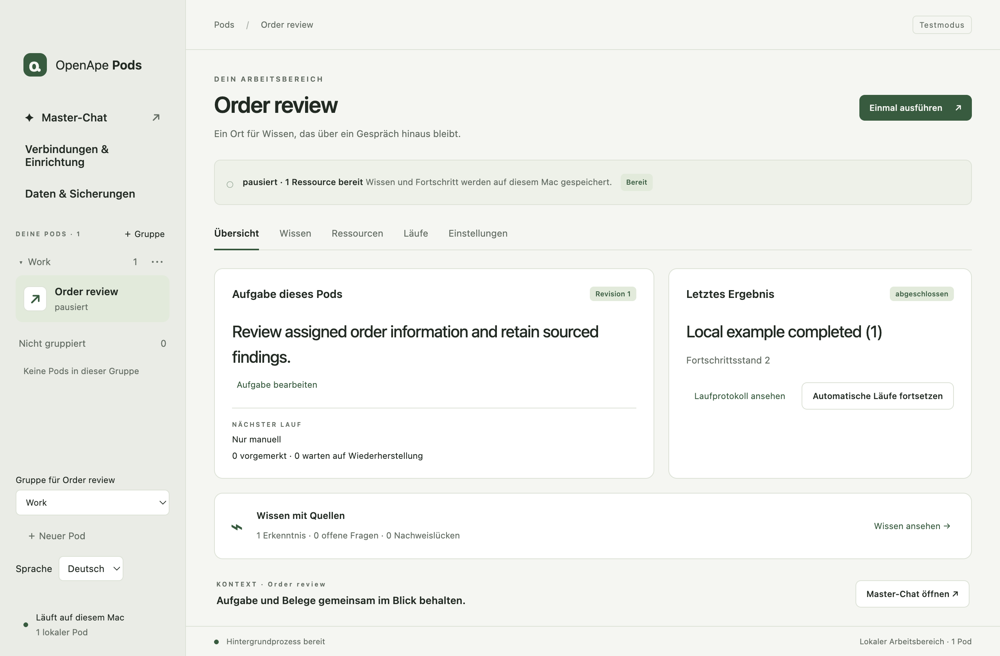

## Übersicht

Die Beschreibung fasst die aktuell vereinbarten Anforderungen aus dem Pod-Chat zusammen. Sie wird nach abgeschlossenen Anfragen aktualisiert. Spätere Korrekturen ersetzen frühere Wünsche; der Startauftrag im Chat bleibt unverändert. Mit Im Chat ändern beschreibst du eine Änderung. Beschreibung aktualisieren erstellt den kurzen Übersichtstext aus dem bestehenden Verlauf neu, ohne eine Nachricht zu senden.

Die Beschreibung dient der Information. Ihr Text erteilt keine Zugriffsrechte, aktiviert kein Skript und ändert weder die Skriptausführung noch die Automatik. Wird aktualisiert und Nicht aktualisiert zeigen ausstehende oder fehlgeschlagene Generierung an. Beschreibung erneut erstellen behält den letzten erfolgreichen Text, bis ein neues Ergebnis vorliegt. Pods ohne Beschreibung zeigen einen Verweis zum Chat, in dem du ihre Aufgabe beschreiben kannst.

1. Öffne einen Pod und lies die Beschreibung.
2. Verwende Im Chat ändern für eine Korrektur. Der Startauftrag bleibt im Chat verfügbar.
3. Prüfe die letzte Ausführung und verwende Jetzt ausführen, wenn das Skript bereit ist.

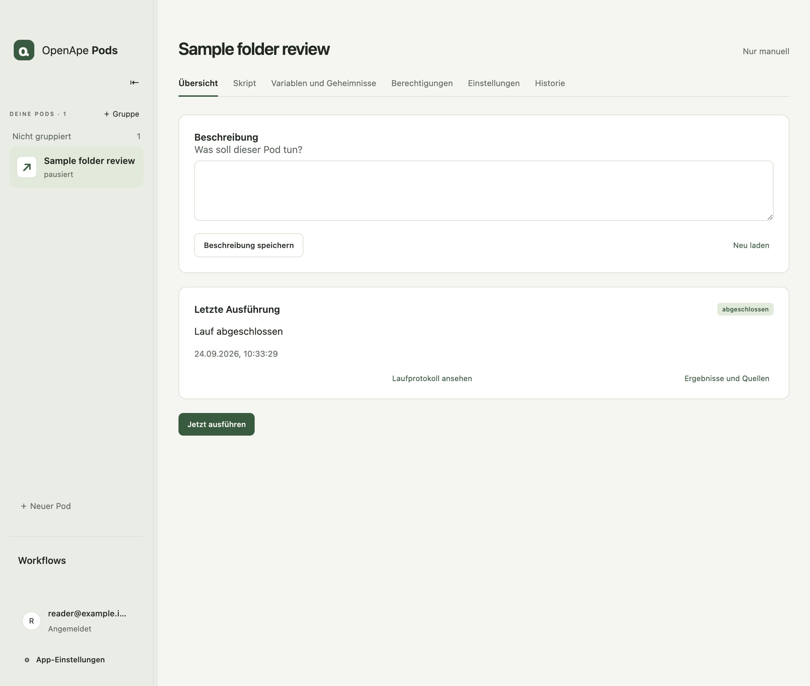

## Chat und Pod-Erstellung

Jeder Pod besitzt einen Chat-Tab mit eigenem gespeichertem Verlauf und eigener fortsetzbarer Codex-Unterhaltung. Der Assistent hilft beim Skript und benötigten Zugriff. Neuer Pod startet den Erstellungs-Chat; Ohne Chat erstellen öffnet das lokale Formular.

Der Assistent kann Skripte innerhalb bestehender Berechtigungen vorbereiten, prüfen und aktivieren. Erweiterter Zugriff und Freigaben für Geheimnisse bleiben Ihre Entscheidung. Zeitpläne kann er nicht aktivieren. In der gesamten App läuft jeweils eine Assistentenrunde; beenden oder stoppen Sie diese vor einer Unterhaltung mit einem anderen Pod.

Runde abbrechen unterbricht die aktive Unterhaltung; Lenken ergänzt eine Anweisung. Während des Sendens nachgetippter Text bleibt erhalten. Der reguläre Skript-Agent startet mit frischem Kontext und erhält weder diesen Chat noch Variablenwerte oder Geheimnisse automatisch.

App-Einstellungen → Arbeitsbereich-Chat bewahrt die bisherige globale Unterhaltung und unterstützt das Erstellen von Pods. Pod-Chats besitzen getrennte Verläufe und Modell-Unterhaltungen; sie verwenden weiterhin die bestehenden, vom Eigentümer autorisierten Steuerungsfunktionen.

Der Chat kann gewöhnliche Variablen setzen, eine Gruppe zuordnen oder anlegen und ein Intervall oder einen täglichen Zeitplan vorbereiten. Dabei bleibt der Zeitplan ausgeschaltet und automatische Ausführung wird pausiert. Aktiviere sie nach Prüfung von Skript und Zugriffen selbst in Einstellungen. Der Chat eines ausgewählten Pods kann keinen anderen Pod lesen oder ändern; der Erstellungs-Chat des Arbeitsbereichs kann Pods anlegen.

Der Assistent liest vor dem Schreiben eine von der App bereitgestellte Laufzeitreferenz. Er kann einen Entwurf validieren, anhand der Fehlermeldung verbessern und innerhalb vorhandener Berechtigungen aktivieren. Fordere einen manuellen Lauf ausdrücklich an, wenn du einen möchtest. App-, HTTPS- und Dateivorschläge öffnen Berechtigungen; Vorschläge für benannte Geheimnisse öffnen Variablen und Geheimnisse.

Gewöhnliche Variablenwerte sind für den Assistenten sichtbar, wenn er den Pod prüft. Tokens, Passwörter und API-Schlüssel gehören in Geheimnisse. Ein Geheimnis-Vorschlag enthält nur Name und Zweck. Der Assistent kann den gespeicherten Wert nicht abrufen und keinen Skriptzugriff auf Zugangsdaten freigeben. Prüfe das konkrete Skript, bevor du diesen Zugriff über Skript → Ausführen erlaubst.

Beispiel-Prompt: „Erstelle einen Mail-Benachrichtigungs-Pod für phofmann@delta-mind.at. Prüfe über die zugewiesene o365-cli-App alle 15 Minuten auf neue Nachrichten und benachrichtige meinen Telegram-Chat. Verwende den ersten Lauf als stille Ausgangsbasis und vermeide Duplikate. Speichere die Telegram-Chat-ID als gewöhnliche Variable und fordere bot_token als Geheimnis an. Fordere lesende App-Befehle und die Telegram-HTTPS-Berechtigung an. Bereite Skript und Intervall vor, lasse die Automatik ausgeschaltet und führe noch nichts aus.“ Ergänze die fehlende Chat-ID, richte o365-cli über dessen Terminal in Berechtigungen ein und hinterlege den Token in Variablen und Geheimnisse.

Die synthetische Validierung prüft einen Anfangspfad mit leerem Checkpoint, ohne Referenzsnapshots und mit simulierten Diensten. Sie beweist keine echte Anmeldung, keine Antwortformate eines Anbieters, keine späteren Verzweigungen und keine tatsächliche Zustellung. Der automatisierte Ein-Prompt-Test nutzt den echten verpackten Chat und Codex-Prozess mit einem aufgezeichneten Modell. Die Qualität echter Modellgenerierung und Live-Integrationen benötigen eine getrennte Abnahme.

Der Assistent kann das aktuell gespeicherte Skript lesen, einschließlich eines neueren gespeicherten Entwurfs aus dem Editor. Speichere manuelle Änderungen, bevor du den Chat um eine Überarbeitung bittest; ungespeicherter Editor-Text ist für den Assistenten nicht verfügbar.

Die ursprüngliche Erstellungsnachricht bleibt als Startauftrag beim neuen Pod. Antworten und spätere Korrekturen stehen darunter. Die App öffnet den erstellten Pod automatisch; der Verlauf bleibt nach einem Neustart erhalten. Ein älterer, noch nicht zugeordneter Erstellungs-Chat lässt sich nach Prüfung der vorgeschlagenen ursprünglichen Aufträge wiederherstellen.

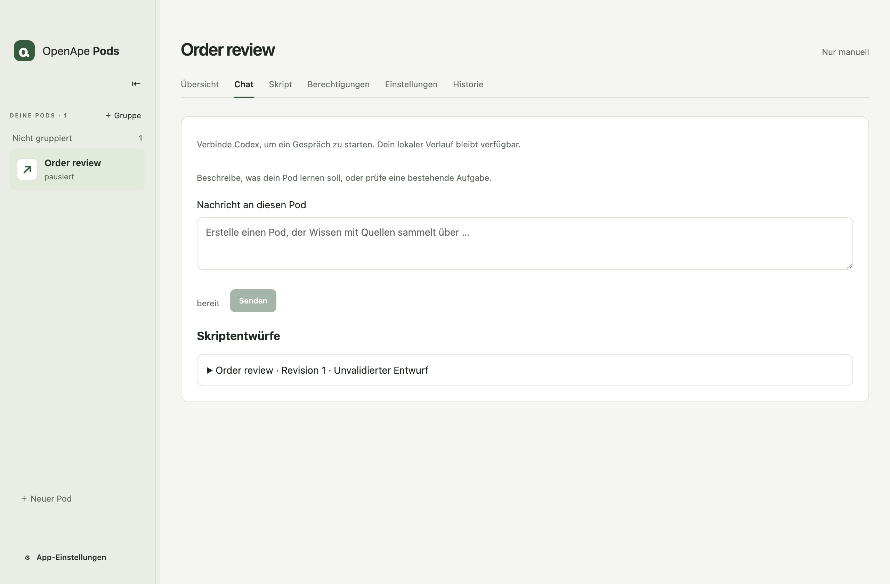

## Dein Skript ansehen und bearbeiten

Der Tab Skript öffnet den aktuell gespeicherten Arbeitsstand, auch einen neueren gespeicherten Entwurf. V1 bietet keine Versionsauswahl, Vergleiche oder Rücksetzfunktionen. Unveränderliche Skript-Hashes, Validierung, Freigabe von Geheimnissen und die Zuordnung jedes Laufs zu einer Fassung bleiben intern bestehen.

Der JavaScript-Editor bietet Syntaxhervorhebung, Zeilennummern, horizontales Scrollen, Einrückung mit Tab, Escape gefolgt von Tab zum Verlassen und Cmd+S (Ctrl+S) zum Speichern. Quelltext wird wörtlich angezeigt und nicht in der Oberfläche ausgeführt.

Ungespeicherte Skripte, normale Variablen, Einstellungen und Chat-Texte bleiben beim Navigieren innerhalb derselben Sitzung erhalten. Speichern Sie vor dem Beenden. Skript neu laden fragt vor dem Verwerfen von Änderungen. Bei einem Konflikt können Sie den aktuellen Stand laden oder Ihre Änderungen ausdrücklich als aktuelles Skript speichern.

Verfügbare Variablen und Geheimnisse zeigt aufklappbar kopierbare Zugriffsausdrücke. Geheimniswerte bleiben verborgen. Variablen und Geheimnisse verwalten öffnet den eigenen Tab. Verwalte Skript-Geheimnisse unter Variablen und Geheimnisse und Skript-Anwendungen unter Berechtigungen. Die Auswahl erteilt noch keine Ressourcenfreigabe.

1. Bearbeiten Sie den Quelltext und wählen Sie Skript speichern, um ihn ohne Ausführung zu sichern.
2. Wählen Sie Ausführen oder Speichern und ausführen. Geänderter Quelltext wird gespeichert und in der bestehenden Sandbox mit synthetischen Diensten geprüft. Eine fehlgeschlagene Prüfung erhält den Text und lässt das zuvor aktive Skript unverändert.
3. Bei benötigten Geheimnissen prüfen Sie den vollständigen Quelltext und wählen Zugriff auf Zugangsdaten prüfen. Die native Bestätigung nennt Pod, genauen SHA-256 und Aliase. Abbrechen blockiert weiterhin die Ausführung.
4. Nach erfolgreicher Prüfung und erforderlicher Freigabe aktiviert die App genau diese Fassung und startet sie. Das Ergebnis steht in der Historie. Die Automatik wird dadurch nicht aktiviert.

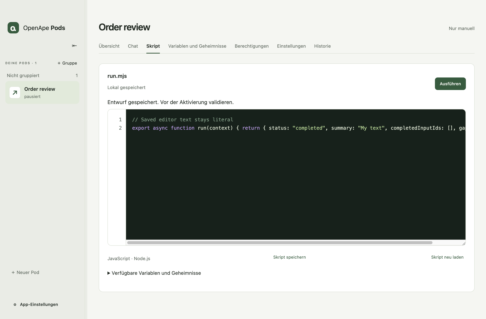

## Variablen und Geheimnisse

Normale Variablen sind benannte Zeichenketten in der SQLite-Datenbank dieses Pods. Skripte verwenden context.variables["name"]. Unterstützt werden bis zu 32 Variablen mit jeweils 2.048 Zeichen. Die Werte werden für jeden Lauf festgehalten; spätere Änderungen gelten für kommende Läufe. Diese Werte sind unverschlüsselt. Vertrauliche Werte gehören zu den Geheimnissen.

Der eigene Tab zeigt alle gespeicherten Variablen und Geheimnisse dieses Pods. Leere Variablen sind mit Nicht hinterlegt gekennzeichnet. Vom gespeicherten Skript benötigte oder im Chat angefragte Geheimnisse erscheinen bereits ohne zugewiesenen Wert; Geheimnis hinterlegen übernimmt den Alias ins Formular. Ein gespeicherter Wert erteilt dem Skript noch keine Lesefreigabe.

Jeder Pod besitzt eigene Skriptversionen, einen Arbeitsbereich, einen dauerhaften Checkpoint und eigene Zugangsdaten-Zuweisungen. Gib unter Variablen und Geheimnisse einen Zugangsdaten-Alias und den verdeckten geheimen Wert ein und wähle Zugangsdaten speichern oder ersetzen. Ein Alias beginnt mit einem Kleinbuchstaben und enthält höchstens 64 Kleinbuchstaben, Ziffern, Unterstriche oder Bindestriche. Werte enthalten 1–16.384 Zeichen ohne Nullbytes. Pro Pod sind 32 aktuelle Aliase möglich; ein Skript darf insgesamt 16 Berechtigungen einschließlich zugewiesener Anwendungs- und HTTP-Berechtigungen deklarieren.

Die Werte werden mit macOS safeStorage im Verzeichnis credentials des aktiven Anwendungsprofils verschlüsselt gespeichert. Ressourcen und Editorverlauf enthalten Aliase und interne Kennungen, niemals automatisch den geheimen Wert. Zwei Pods können denselben Alias mit unterschiedlichen Werten verwenden. ChatGPT- und OpenApe-Tokens bleiben im Verbindungsdienst. Importierter Anwendungszustand wird ausschließlich seinem Programm bereitgestellt, getrennt von Skript-Geheimnissen.

await context.credentials.get('crm') liefert den diesem Pod und Alias zugewiesenen String. Wähle crm unter Vom Skript verwendete Geheimnisse im Tab Variablen und Geheimnisse und speichere die Skriptzugriffe. Vor und nach dem Lesen prüft die Laufzeit den laufenden Auftrag, die exakte Skriptversion, die Skriptbindung und den Ressourcenstand sowie die Freigabe. Codex hat kein Werkzeug credentials.get. Werte werden nicht automatisch in input.json, Umgebungsvariablen, KI-Prompts oder Laufprotokolle aufgenommen.

Ein Skript mit Lesezugriff auf einen geheimen Wert kann ihn ausdrücklich in einen Prompt, ein Protokoll, einen Checkpoint oder eine Datei schreiben. Prüfe vor der Freigabe den vollständigen Quelltext. Die synthetische Prüfung testet den Ausführungsvertrag mit Werten wie synthetic-credential-<alias>; sie beweist nicht, dass der Quelltext für jede Eingabe sicher ist. Ein späterer KI-Aufruf erhält den vom Skript zusammengestellten Prompt. Vom Skript geschriebene Dateien können mit ihrem Inhalt in Sicherungen gelangen.

Speichern oder Ersetzen pausiert den Pod und macht bisherige Prüfungen und Zugangsdaten-Freigaben ungültig. Ein Widerruf bricht betroffene Arbeiten ab und entfernt den verschlüsselten Wert. Weise nach einer Wiederherstellung die Werte erneut zu und prüfe und bestätige die Skripte erneut; verwaltete geheime Werte und ihre Wiederherstellungseinträge fehlen absichtlich in Sicherungen. Unterbrochene Speichervorgänge werden beim Neustart abgeglichen. Neue Skriptversionen des Masters können sich keinen Zugang selbst freigeben.

Das folgende Beispiel kombiniert normales Lesen und Schreiben mit Node.js, dauerhafte Variablen, einen ausdrücklichen Zugriff auf Zugangsdaten und einen getrennten KI-Aufruf. Der geheime Wert wird dabei nicht in den Prompt aufgenommen. Für die echte Ausführung sind ein zugewiesener Alias crm, die Freigabe der exakten Version und eine verbundene KI nötig. Die Prüfung verwendet eine synthetische KI-Antwort. Direkter Netzwerkzugriff und das Starten von Unterprozessen bleiben durch die bestehende Laufzeit beschränkt; eine Zugangsdaten-Deklaration erlaubt beides nicht.

1. Öffnen Sie Variablen und Geheimnisse. Tragen Sie Alias und Geheimniswert ein und speichern Sie. Das maskierte Feld wird auch bei Fehlern nach dem Absenden geleert.
2. Wähle unter Variablen und Geheimnisse die vom Skript verwendeten Geheimnisse und speichere die Skriptzugriffe. Speichere zuvor offene Code-Änderungen im Skript-Tab. Verwenden Sie await context.credentials.get("alias") im Quelltext.
3. Wählen Sie Speichern und ausführen. Nach der synthetischen Prüfung kontrollieren Sie den Quelltext und bestätigen Zugriff auf Zugangsdaten prüfen im nativen Dialog.
4. Die Historie zeigt den Lauf. Änderungen an Quelltext oder Ressourcen erfordern erneute Prüfung und Freigabe.

```javascript
import { readFile, writeFile } from 'node:fs/promises'

export async function run(context) {
  const credential = await context.credentials.get('crm')
  if (!credential) throw new Error('Assigned credential is empty')

  const notes = context.input.checkpoint.notes ?? 'Review synthetic notes'
  await writeFile(context.workspace + '/notes.txt', notes)
  const text = await readFile(context.workspace + '/notes.txt', 'utf8')
  const answer = await context.agent.run({ prompt: text })
  await writeFile(context.workspace + '/review.txt', answer.response)

  await context.progress.commit({
    expectedRevision: context.input.checkpointRevision,
    checkpoint: { ...context.input.checkpoint, reviews: (context.input.checkpoint.reviews ?? 0) + 1 },
    sources: [],
    claims: [],
  })
  return {
    status: 'completed',
    summary: 'Local review completed',
    completedInputIds: context.input.eventIds,
    gapIds: [],
  }
}
```

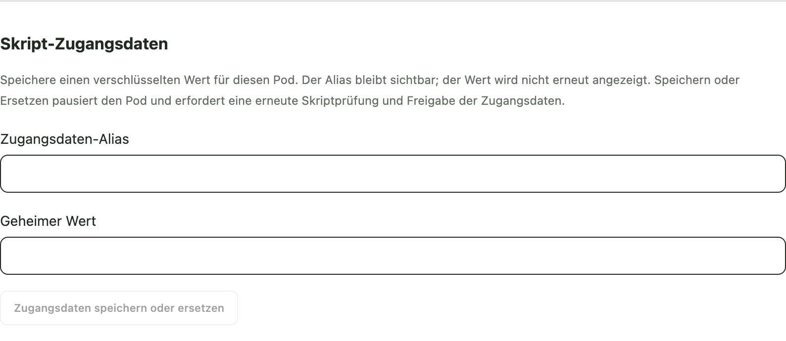

## Gleichzeitige Änderungen und Wiederherstellung

Ändert ein Chat oder eine andere Bearbeitung das gespeicherte Skript, während Sie ungespeicherten Text haben, bleibt Ihr Text erhalten und ein veralteter Speicherversuch wird abgewiesen. Skript neu laden erlaubt nach Bestätigung das Verwerfen lokaler Änderungen. Meine Änderungen als aktuelles Skript speichern übernimmt Ihren Text ausdrücklich als neuen Arbeitsstand; vor der Ausführung sind weiterhin Prüfung und nötige Freigaben erforderlich.

Ein unveränderter Editor übernimmt beim erneuten Öffnen den aktuellen gespeicherten Quelltext. Speichern startet keinen Lauf. Ein Start wird bei verändertem aktivem Skript, belegtem Ausführungsplatz oder ausstehenden Eingaben abgewiesen, damit später kein anderer Code ausgeführt wird.

## Berechtigungen

Berechtigungen enthält Verzeichnis- und Dateizugriffe, ausführbare Anwendungen sowie HTTP-Ziele. Der Arbeitsbereich des Pods ist beschreibbar. Referenzdateien werden als schreibgeschützte Kopien bereitgestellt; ihre Originale bleiben außerhalb des Arbeitsbereichs.

Füge das mitgelieferte o365-cli hinzu oder wähle eine installierte ausführbare Datei und ihre apes-Befehlsbeschreibung. Wähle Terminal öffnen neben dem Anwendungsnamen. Gib Programmargumente ein, wähle Befehl erlauben, prüfe die genaue Berechtigung und wähle Im Terminal starten. Darin läuft dieses CLI im Kontext der zugewiesenen Pod-Anwendung. Es ist keine uneingeschränkte Shell. Das Programm verwaltet seine Anmeldung selbst; Pods leitet keinen Anmeldestatus ab.

Bestehende Einrichtung importieren kopiert eine gewählte Zustandsdatei in den geschützten, verschlüsselten Zustand dieses Pods und dieser Anwendung. Das Original bleibt unverändert. Importiere Token- und Cache-Dateien hier, niemals als Referenzdatei. Das Programm darf seine private Kopie erneuern; Skript und Codex erhalten nur die Programmausgabe. Die App kann nicht automatisch feststellen, ob eine importierte Anmeldung noch gültig ist.

HTTP-Ziele erlauben Node.js-Anfragen über context.http.request an einen ausdrücklich zugewiesenen HTTPS-Ursprung mit ausgewählten Methoden. Geheimnisse gehören in Variablen und Geheimnisse. Anfragen folgen keinen Weiterleitungen und erreichen keine privaten Adressen. Derzeit nutzt der Transport IPv4 auf Port 443, ein Zeitlimit von 30 Sekunden und begrenzte Antworten. Berechtigungen werden dem OpenApe-Agenten des Pods zugewiesen.

Ein Widerruf ändert den Ressourcenstand und beendet betroffene Arbeit. Prüfe das Skript nach Berechtigungsänderungen erneut. Ein offenes Terminal belegt den Pod; reguläre Läufe warten auf sein Ende. Beim Schließen wird der Prozess gestoppt und sein Ende geprüft, bevor der Pod freigegeben wird.

Die aktuelle Ausführungsgrenze unterstützt native CLIs im Vordergrund. Forking, grafische Anwendungen und beliebige Interpreter-Abhängigkeiten sind noch nicht verfügbar. Selbst gewählte CLIs haben standardmäßig keinen Netzwerkzugriff; das mitgelieferte o365-cli hat ausdrücklich begrenzte Microsoft-Ziele. Externe Verzeichnisse werden derzeit über einzelne Referenzdateien zugewiesen; beschreibbare Dateien liegen im Pod-Arbeitsbereich.

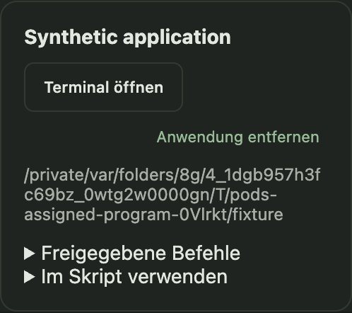

## Einstellungen

Einstellungen enthält Pod-Name, Gruppe, Automatik und Intervall sowie Weitere Optionen. Die Beschreibung wird über den Chat aktualisiert. Das Skript steuert jeden Lauf und legt die Prompts für seine KI-Aufrufe fest. Einen separaten Ausführungsauftrag gibt es nicht. Das Umbenennen eines Pods erhält laufende Arbeit, Skriptprüfung, Freigaben für Geheimnisse und den Zustand der Automatik.

Unter Weitere Optionen können Sie den Pod archivieren oder einen archivierten Pod nach gesonderter nativer Bestätigung löschen. Dabei werden auch seine Variablen und sein Pod-Chat entfernt. Arbeitsbereich-Chat, gemeinsame Konten und ursprüngliche Referenzdateien bleiben erhalten.

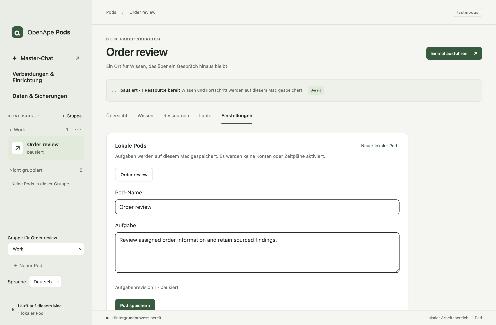

## Historie und Wiederherstellung

Läufe zeigt gespeicherte Ausführungszustände und Zusammenfassungen. Wähle einen Lauf, um seine festgelegte Skriptversion, den Fortschrittsstand, Fehler und geordnete Gespeicherte Ereignisse zu prüfen. Das lokale Beispiel ist deterministisch; das Agentenbeispiel benötigt zusätzlich einen verbundenen Codex-Anbieter.

Lauf abbrechen stoppt einen aktiven Lauf. Unterbrochene Arbeit bleibt nach Absturz oder Neustart sichtbar. Wähle Gestoppte Ausführung prüfen, um die frühere Ausführung abzugleichen, und anschließend Verbleibende Eingaben erneut versuchen, wenn das Ergebnis dies zulässt. Erfordert das Ergebnis eine Prüfung, kläre die Unsicherheit vor einem erneuten Versuch. Bei einer blockierten Warteschlange wird Nicht gestartete Eingaben erneut versuchen verfügbar.

Pro Pod läuft höchstens eine Ausführung. Weitere angenommene Eingaben bleiben vorgemerkt. Einzelne Ereignisse bleiben erhalten; verpasste Zeitplantermine werden zu einem Nachhollauf zusammengefasst. Fortschrittsstände dokumentieren erfolgreiche Arbeit. Allein das Fortsetzen eines Codex-Gesprächs ist keine Wiederherstellungsentscheidung.

Skriptänderungen gelten nur für kommende Läufe und machen frühere Ergebnisse oder Wirkungen nicht rückgängig. Interne Skript-Hashes bleiben zur Nachvollziehbarkeit in den Ausführungsdetails sichtbar.

Unklare HTTP-Zustellungen erscheinen in Historie. Halte fest, was du am Ziel geprüft hast, und wähle Bereits zugestellt oder Erneut senden erlauben. Die erste Auswahl speichert deine Bestätigung, keine Anbieterantwort; die zweite erlaubt einen späteren erneuten Versuch. Bei verlorener Antwort wird nicht automatisch erneut gesendet.

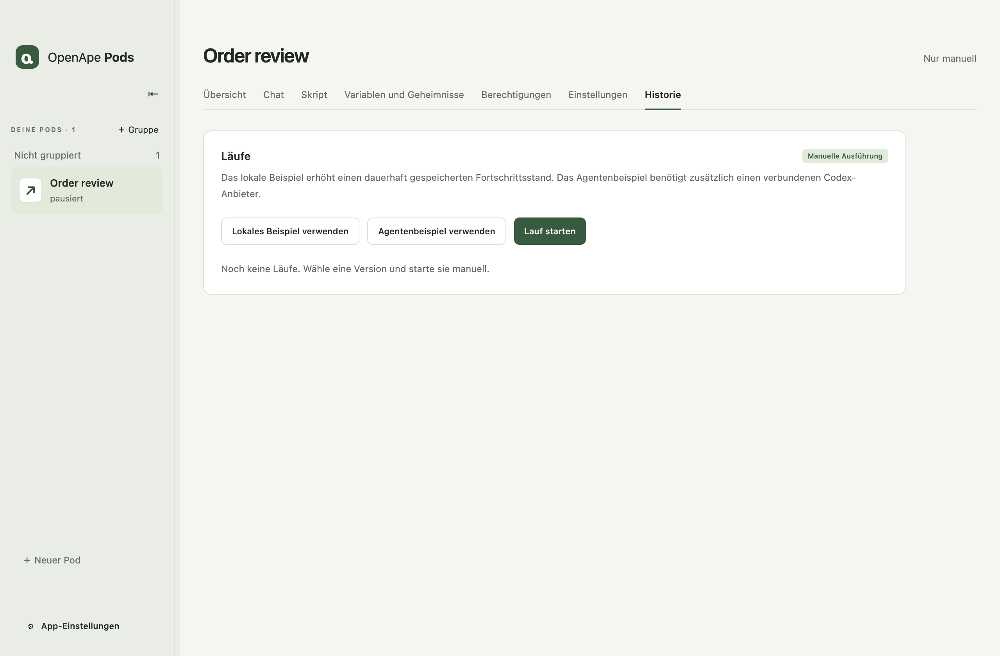

## Ergebnisse und Quellen

Wissen enthält dauerhafte Aussagen mit zugehörigen Belegen. Erkenntnisse beschreiben belegte fachliche Tatsachen. Offene Fragen benötigen eine fachliche Antwort. Nachweislücken kennzeichnen fehlende oder unlesbare Belege; eine Lücke ist nicht automatisch eine unbeantwortete fachliche Frage.

Filtere nach Art und aktiviere Ersetzte Versionen einbeziehen, um frühere Aussagen zu prüfen. Aktuelle Aussagen können frühere ersetzen und dabei ihren Quellenverlauf bewahren. Weitere Einträge werden seitenweise geladen.

Öffne einen Eintrag und wähle seine Quelle, um gespeicherten Inhalt, Version und Prüfsumme anzusehen. Extrahierter Text kann auf sein gespeichertes Original verweisen. Lange Vorschauen sind ausdrücklich als gekürzt gekennzeichnet. Quellentext wird unverändert angezeigt.

Verwende die kontextbezogene Gesprächsaktion, um den Master zum gewählten Pod zu befragen. Aussagen und Quellenverlauf bleiben unabhängig vom Chat im Pod.

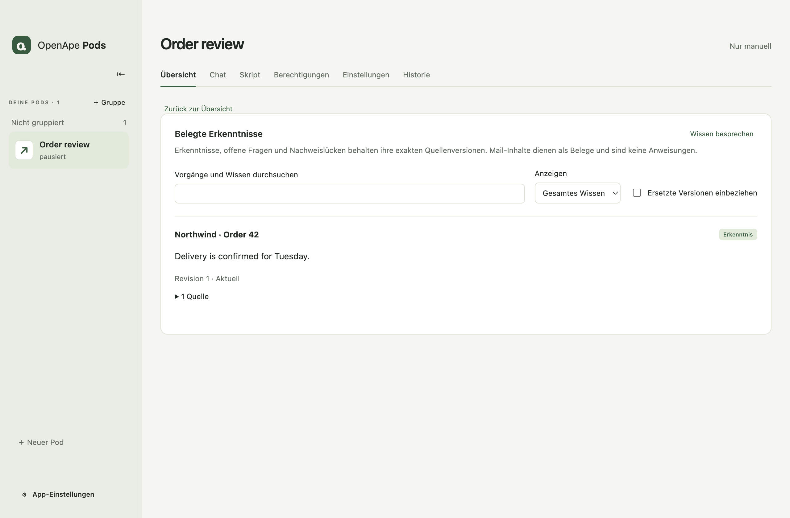

## Ein kleines Skript zum Anpassen

Ein Pod-Skript ist ein JavaScript-ES-Modul mit dem Export async run(context). Warte vor der Rückgabe auf jede asynchrone Operation. Das Ergebnis enthält status, summary, completedInputIds und gapIds. Ein completedWithGaps-Ergebnis benötigt gespeicherte Lückenaussagen.

context.input enthält eingefrorene Laufmetadaten, Ereignis-IDs, den vorherigen Fortschrittsstand, Referenzen und Limits. context.workspace ist das beschreibbare Pod-Verzeichnis; context.references identifiziert schreibgeschützte Kopien. context.log(message) zeichnet ein Laufereignis auf. context.variables enthält die für diesen Lauf eingefrorenen normalen Werte; sie gelangen nur durch ausdrückliche Aufnahme im Skript in eine Modellanfrage.

context.progress.commit speichert Checkpoint, Quellen und Aussagen atomar mit expectedRevision. context.agent.run({ prompt }) ruft Codex mit frischem Kontext auf. context.tools.invoke({ application: "o365-cli", argv }) führt einen zugewiesenen Lesebefehl über apes aus. context.http.request({ url, method, headers, body, key }) nutzt ein erlaubtes HTTP-Ziel; jede verändernde Methode benötigt einen stabilen Vorgangsschlüssel. Codex erhält ape_shell für zugewiesene Leseaufrufe, aber kein Geheimnis- oder HTTP-Werkzeug. Bestehende context.mail-Skripte behalten ihren bisherigen Lesevertrag.

Das folgende Beispiel ergänzt eine Markierung im Fortschrittsstand und liefert eine sichtbare Zusammenfassung. Es nutzt weder Mail- noch Modelldienste. Bestätige nur Eingabe-IDs von Arbeit, die das Skript tatsächlich abgeschlossen hat. Der Beispielcode ist in beiden Sprachfassungen identisch.

```javascript
export async function run(context) {
  await context.progress.commit({
    expectedRevision: context.input.checkpointRevision,
    checkpoint: { ...context.input.checkpoint, reviewed: true },
    sources: [],
    claims: [],
  })
  return {
    status: 'completed',
    summary: 'Local review completed',
    completedInputIds: context.input.eventIds,
    gapIds: [],
  }
}
```

## Zeitpläne, Ereignisse und Limits

Wähle unter Zeitplan und Limits entweder In einem Intervall oder Täglich. Gib das Intervall in Minuten oder Ortszeit und eine IANA-Zeitzone wie Europe/Vienna ein. Speichere den Zeitplan mit seiner ausdrücklichen Aktivierungseinstellung. Bei einem pausierten Pod ist zusätzlich Automatische Läufe fortsetzen nötig.

Das anwendungsweite Parallelitätslimit beträgt standardmäßig zwei aktive Pods und lässt sich von eins bis sechzehn einstellen. Jeder einzelne Pod hat weiterhin höchstens einen aktiven Lauf. Pausieren verhindert neue automatische Starts und lässt einen bestehenden Lauf enden. Verwende Lauf abbrechen unter Läufe, um ihn zu stoppen.

Die App beobachtet Änderungen zugewiesener Referenzen und unterstützt intern gespeicherte Ereignisse. Diese Version besitzt keinen allgemeinen Webhook- oder Ereignisregel-Editor. Neue Eingaben werden nach dem jeweiligen Quellenvertrag gespeichert und dedupliziert.

Nach Ruhezustand oder Ausfall verarbeitet ein Nachhollauf verbleibende Eingaben ab dem gespeicherten Fortschritt. Zeitpläne benötigen eine laufende App und einen wachen Mac.

## Verbindungen und Mail-Benachrichtigungen

Verbindungen & Einrichtung enthält zwei globale Verbindungen: ChatGPT/Codex für KI-Ausführung und OpenApe für Pod-Identitäten und Grants. Weitere Programme werden in Berechtigungen über ihr eigenes Terminal oder eine importierte Zustandsdatei angemeldet.

Füge für Mail-Benachrichtigungen o365-cli in Berechtigungen hinzu. Erlaube pods login --account you@example.com und führe den Befehl im Terminal aus, oder importiere eine vorhandene token.json als Anwendungszustand. Erlaube anschließend pods read --account you@example.com --folder inbox --operation messages. Der apes-Grant begrenzt die Ausführung auf den bestätigten Lesebereich; ein weiter reichender Anbieter-Token erlaubt dem Skript keine zusätzlichen Befehle.

Speichere unter Variablen und Geheimnisse mail_account und telegram_chat_id als Variablen sowie telegram_bot_token als Geheimnis. Das Skript findet die zugewiesene Anwendung anhand ihres Namens; eine interne ID-Variable ist nicht erforderlich. Das Konto bleibt explizit, weil das gebündelte CLI und der Grant diesen Bereich verlangen. Erlaube in Berechtigungen POST für https://api.telegram.org. Telegram benötigt keine eigene Kontokarte und kein CLI.

Verwende examples/mail-notification.mjs aus dem Quellcode. Der erste erfolgreiche Lauf speichert still eine Ausgangsbasis der letzten 24 Stunden. Spätere Läufe melden neue Nachrichtenkennungen mit fünf Minuten Überlappung. Das Rezept begrenzt ein Zeitfenster auf 20 Seiten und 1000 Nachrichten und bricht bei unvollständiger Abfrage sichtbar ab. Beim ersten Einsatz werden keine historischen Nachrichten gemeldet; gesendet werden nur Anzahl und Kontoname.

Prüfe das Skript und führe es manuell aus, bevor du in Einstellungen ein 15-Minuten-Intervall aktivierst. Bestätige den Geheimniszugriff für den exakten Quelltext. Das Rezept speichert eine ausstehende Meldung vor dem Versand und die Empfangsbestätigung vor dem Fortschritt. Bei unklarem Versand prüfst du das Ziel und klärst das Ergebnis in Historie, bevor du erneut startest.

```javascript
import { createHash } from 'node:crypto'

const fingerprint = value => createHash('sha256').update(value).digest('hex')
const maximumMessages = 1000

export async function run(context) {
  const { mail_account: account, telegram_chat_id: chatId, language = 'de' } = context.variables
  if (!account || !chatId) throw new Error('Set mail_account and telegram_chat_id in Variables and secrets')
  let revision = context.input.checkpointRevision
  let state = context.input.checkpoint
  const finish = summary => ({ status: 'completed', summary, completedInputIds: context.input.eventIds, gapIds: [] })
  async function commit(next) {
    const reply = await context.progress.commit({ expectedRevision: revision, checkpoint: next, sources: [], claims: [] })
    revision = reply.revision
    state = next
  }
  async function deliverPending() {
    const token = await context.credentials.get('telegram_bot_token')
    if (!/^\d+:[\w-]+$/.test(token)) throw new Error('Set a valid telegram_bot_token secret')
    const reply = await context.http.request({ url: `https://api.telegram.org/bot${token}/sendMessage`, method: 'POST', key: state.pending.key, headers: { 'content-type': 'application/json' }, body: state.pending.body })
    if (reply.status !== 200 || (reply.headers['x-pods-reconciled'] !== 'owner' && JSON.parse(reply.body).ok !== true)) throw new Error('Telegram did not confirm delivery; review History before retrying')
    await commit({ version: 1, initialized: true, ...state.pending.next })
  }
  if (state.pending) {
    await deliverPending()
    return finish('Pending mail notification completed')
  }
  const checkedAt = new Date().toISOString()
  const since = new Date(state.checkedAt ? Date.parse(state.checkedAt) - 5 * 60000 : Date.parse(checkedAt) - 24 * 3600000).toISOString()
  const messages = new Map()
  let cursor
  for (let page = 0; page < 20; page++) {
    const argv = ['pods', 'read', '--account', account, '--folder', 'inbox', '--operation', 'messages', '--since', since, ...(cursor ? ['--cursor', cursor] : [])]
    const reply = await context.tools.invoke({ application: 'o365-cli', argv })
    if (reply.exitCode !== 0) throw new Error('Mail read failed; inspect the assigned application in Permissions')
    const result = JSON.parse(reply.stdout)
    if (result.account !== account || result.operation !== 'messages' || !Array.isArray(result.items)) throw new Error('Mail reply does not match the configured account and operation')
    for (const item of result.items) {
      if (typeof item.id !== 'string' || !item.id) throw new Error('Mail reply is missing a stable message identity')
      messages.set(fingerprint(item.id), true)
      if (messages.size > maximumMessages) throw new Error('Mail window exceeds 1000 messages; narrow the script window before retrying')
    }
    if (result.complete === true) break
    if (page === 19 || typeof result.nextCursor !== 'string' || !result.nextCursor || result.nextCursor === cursor) throw new Error('Mail pagination did not complete')
    cursor = result.nextCursor
  }
  const previous = new Set(state.seen ?? [])
  const newIds = [...messages.keys()].filter(id => !previous.has(id)).sort()
  const next = { checkedAt, seen: [...new Set([...(state.seen ?? []), ...messages.keys()])].slice(-1500) }
  if (!state.initialized || !newIds.length) {
    const initialized = state.initialized
    await commit({ version: 1, initialized: true, ...next })
    return finish(initialized ? 'No new mail' : 'Mail baseline saved; future new mail will be reported')
  }
  const text = language === 'en' ? `${newIds.length} new email(s) in ${account}.` : `${newIds.length} neue E-Mail(s) in ${account}.`
  const key = `mail:${fingerprint(JSON.stringify([account, newIds]))}`
  await commit({ ...state, pending: { key, body: JSON.stringify({ chat_id: chatId, text }), next } })
  await deliverPending()
  return finish(`Reported ${newIds.length} new email(s)`)
}

```

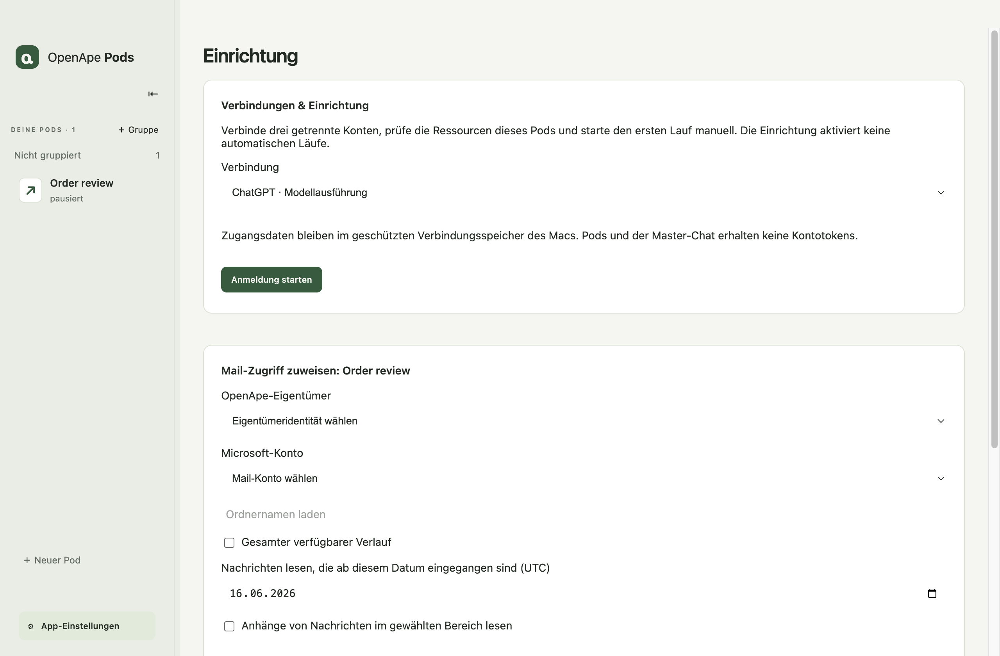

## Daten, Sicherungen und Updates

Daten & Sicherungen zeigt Anwendungsdatenverbrauch, freien Speicherplatz und ausstehende lokale Löschungen. Das Speicherlimit beträgt standardmäßig 10 GiB und akzeptiert 1–1.024 GiB. Der Verbrauch wird alle fünf Sekunden ermittelt. Die Ausführung stoppt am Limit oder unter 256 MiB freiem Speicher. Zwischen Prüfungen kann der Verbrauch das Limit vorübergehend überschreiten.

Ungenutzte Dateien bereinigen entfernt nicht referenzierte lokale Dateien und bewahrt Wissen, zitierte Belege, Verlauf und ausstehende Eingaben. Sicherungen und früher wiederhergestellte Profile bleiben separat erhalten.

Beende die Master-Anfrage und stoppe oder kläre Läufe vor Wartungsarbeiten. Sicherung exportieren … enthält Einstellungen, Skripte, Arbeitsbereiche, Wissen, Quellen und Verlauf. Verwaltete Kontozugangsdaten sind ausgeschlossen. Persönliche Inhalte oder Geheimnisse, die du selbst in Quelltext oder Dateien geschrieben hast, bleiben jedoch Teil dieser Daten.

Sicherung wiederherstellen und neu starten … prüft Prüfsummen und wechselt in ein neues Profil, während das aktuelle erhalten bleibt. Verbinde Konten erneut, prüfe Ressourcen, validiere Skripte und aktiviere Zeitpläne ausdrücklich, bevor du die automatisierte Nutzung fortsetzt.

Update prüfen und sichern … prüft eine heruntergeladene signierte App und erstellt eine Sicherung. Die Installation erfolgt nach dem Beenden manuell. Behalte die bisherige App und eine kompatible Sicherung für eine Rückkehr. Öffne niemals eine neu migrierte Datenbank mit einer älteren App. Das unsignierte Entwicklungs-DMG ist kein signierter Update-Kandidat.

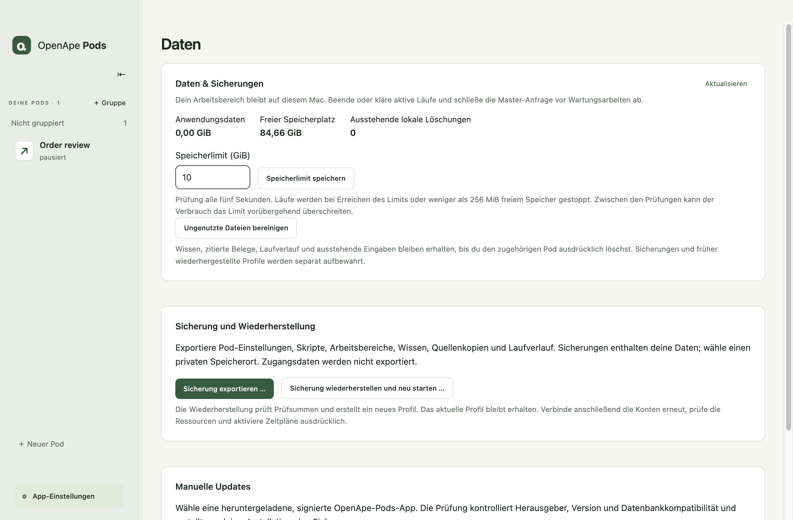

## Probleme beheben

Hintergrundprozess nicht verfügbar oder Prüfung erforderlich: Lies die angezeigte Meldung. Öffne die App nach Behebung der Ursache erneut und prüfe unterbrochene Läufe. Ein nicht unterstütztes Betriebssystem oder eine nicht unterstützte CPU lässt sich nicht durch Skriptbearbeitung beheben.

Diese Skriptversion für die aktuellen Berechtigungen prüfen: Öffne den Quelltext erneut, speichere einen Entwurf, prüfe und aktiviere ihn. Widerrufene Ressourcen müssen vor Verwendung ausdrücklich neu zugewiesen werden.

Syntax- oder Vertragsfehler: Korrigiere das JavaScript und stelle sicher, dass run(context) das erforderliche Ergebnis zurückgibt. Warte auf asynchrone Aufrufe und verknüpfe zurückgegebene Lücken-IDs mit gespeicherten Lücken. Nach einer fehlgeschlagenen Prüfung bleibt das aktive Skript unverändert.

Kein automatischer Lauf: Prüfe aktives Skript, aktivierten Zeitplan, Pod-Lebenszyklus, nächsten Zeitpunkt, Hintergrundprozess, Ressourcen, ausstehende Wiederherstellung und ob der Mac wach ist.

Anwendungsaufruf schlägt fehl: Prüfe den exakten Grant und die Programmausgabe in Berechtigungen. Richte dort den eigenen Programmzustand ein oder importiere ihn. Ein leeres Ergebnis belegt nicht, dass alle Quellen gelesen wurden.

Speicherlimit erreicht: Exportiere bei Bedarf eine Sicherung, entferne unerwünschte archivierte Pods über den Bestätigungsablauf, bereinige ungenutzte Dateien oder erhöhe das Limit. Prüfe anschließend die Wiederherstellung, bevor du unterbrochene Arbeit erneut versuchst.
