# OpenApe Pods · User handbook

[Deutsch](handbook.de.md)

Set up your first Pod, verify a manual result and stay in control of automation.

Generated from handbook.json. Screenshots use the packaged app with synthetic data.

## What Pods does and how to get it

OpenApe Pods is a Mac desktop app for repeatable tasks. Describe a task in chat; the assistant prepares a saved script. Each Pod keeps its own workspace, access permissions, results and history. You review the setup, run it manually and only then decide whether it should run automatically.

Availability — September 2026: Pods is an internal pilot, not a publicly released download. A Developer ID signed and Apple-notarized internal app exists, but public distribution is not approved. This guide provides no public download link or release date. If you have not been given an authorized internal build, you cannot complete installation from this page.

If you have received that build, open its DMG, copy OpenApe Pods into Applications and launch it. The app bundles its runtime; no separate Node.js or Codex installation is needed. Execution is currently restricted to Apple Silicon and Darwin 25.6.0 (verified on macOS 26.6.2). Other OS/CPU combinations display an error and block execution; the packaging minimum is not a promise of runtime support.

For a first task, use a small folder of non-sensitive sample files and read-only access. Keep automatic execution off until you have checked a manual result. All screenshots in this guide use isolated synthetic data. They illustrate the current interface, not a successful connection to your accounts.

## Connect your personal accounts

Open App settings → Your accounts. The page shows exactly two accounts: your DDISA account, with which you decide permission requests, and your Codex / GPT account, which provides AI access for chat and model calls.

Pods finds your identity provider through the DDISA record of your email domain. Every Pod, permission and mobile device uses this one DDISA account; there is nothing to select. Pod agents are not your accounts and are never listed here. Switching to another DDISA account gives your Pods new agents, and their permissions must be granted again.

Other services are configured per Pod: application sign-in belongs in Permissions, and tokens or passwords belong in Variables and secrets. You do not need a personal account or an additional sign-in at pods.openape.ai.

1. Under Your DDISA account, enter your email and choose Sign in. Complete the browser flow and return to Pods; the account shows Signed in.
2. Under Codex / GPT account, choose Sign in. Complete the offered browser flow and check Signed in before using chat.
3. If an account later shows Expired or an error, choose Sign in again on the same account. Enter another email only if you want to switch accounts, and review Confirm switch.
4. Choose Continue to workspace. To change the interface language, use App settings → Language.

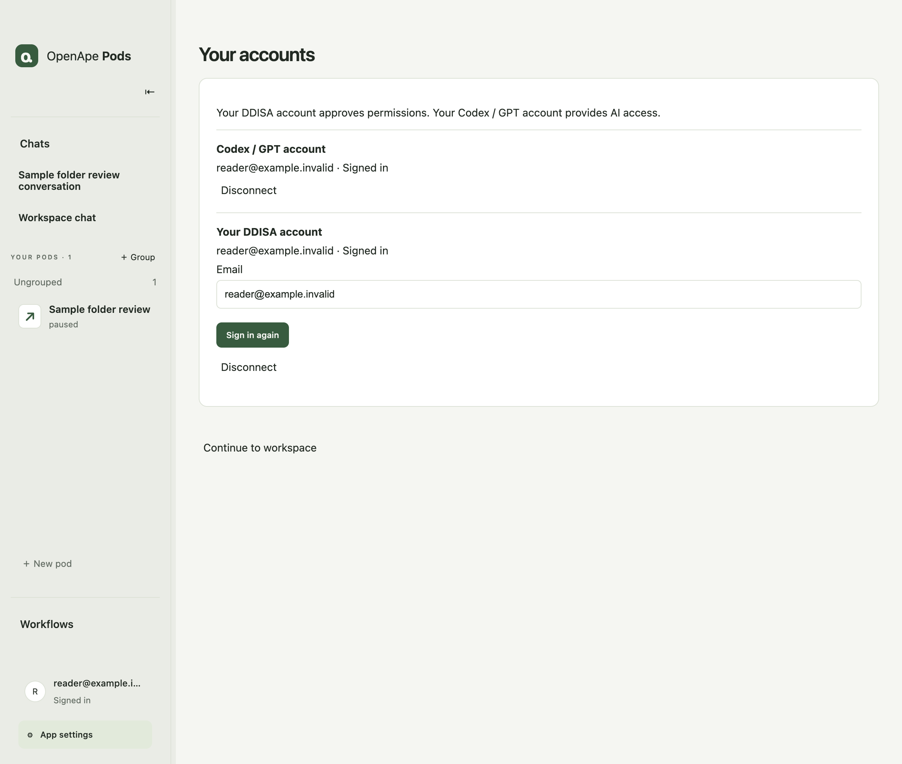

## Create your first Pod in chat

Choose New pod to open the creation chat. Describe the source, desired result, what must remain unchanged and how you will recognize success. A useful first request is: “Create a Pod that lists the names of files in a sample folder and returns the count. Ask me which folder to use, request read-only access, and prepare the script. Do not change files, run it or enable a schedule.”

Choose Chat model before sending. Pods remembers that selection on this Mac and uses it for new and continued chat turns. It does not change models explicitly selected inside a saved script. Enter sends a message; Shift + Enter adds a line. Only one assistant turn can run across the app at a time.

The assistant can save drafts, validate scripts and prepare access requests. You approve additional access. Chat can prepare a schedule but cannot enable it. A reply saying that work is ready is not evidence that the script or permission was actually saved.

1. Answer the ordinary setup questions with Answer question. Give folder choices and non-sensitive options; never paste a password or token into chat or a question answer.
2. Review each proposed folder, application or HTTP destination. Approve only the access the task needs. For a requested secret, follow the protected input form in Variables and secrets.
3. After answering questions and assigning access, choose Continue setup. It asks the assistant to inspect saved progress and finish preparation without starting a run or changing schedules.
4. Open Script and inspect the saved source. Check the chat’s saved-state indicator: a missing script or saved draft is not an active script. If the response was interrupted, use Continue setup; do not assume its announced actions happened.
5. Check Permissions and Variables and secrets against the task. Review Overview → Description, but use the saved Script and actual assignments to verify what will run. Ask the chat to explain unfamiliar code before granting access.

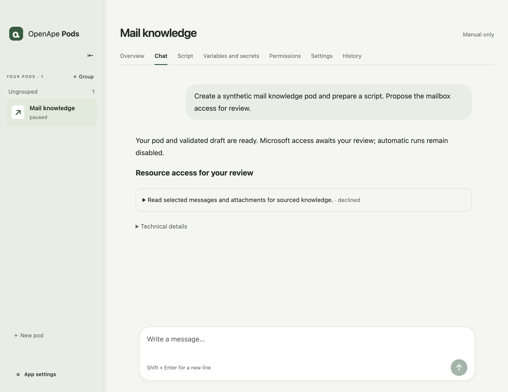

## Review the Pod identity and provider permission

Open the Pod’s Settings → Pod identity. Permission decisions shows your DDISA account. Pod agent identifies the agent acting for this Pod. It is created when you first review permissions; Not created yet before that step is expected.

Before the first Pod agent is created, Pods asks once for permission under Agent provider permission. Choose Allow requests from this provider, check https://pods.openape.ai, agent domain pods.openape.ai and the deciding account, then choose Confirm permission. No additional sign-in at pods.openape.ai is required. The provider creates agents and submits requests; you decide which actions to approve.

This permission belongs to your DDISA account and applies to all your Pods. Although you manage it inside a Pod, it is not limited to that Pod. It does not give the provider the right to approve actions or activate automation.

Existing Pods keep their agent, key and grants. Identity details shows the agent and decision providers for diagnosis. A Pod’s agent changes only when you switch to another DDISA account.

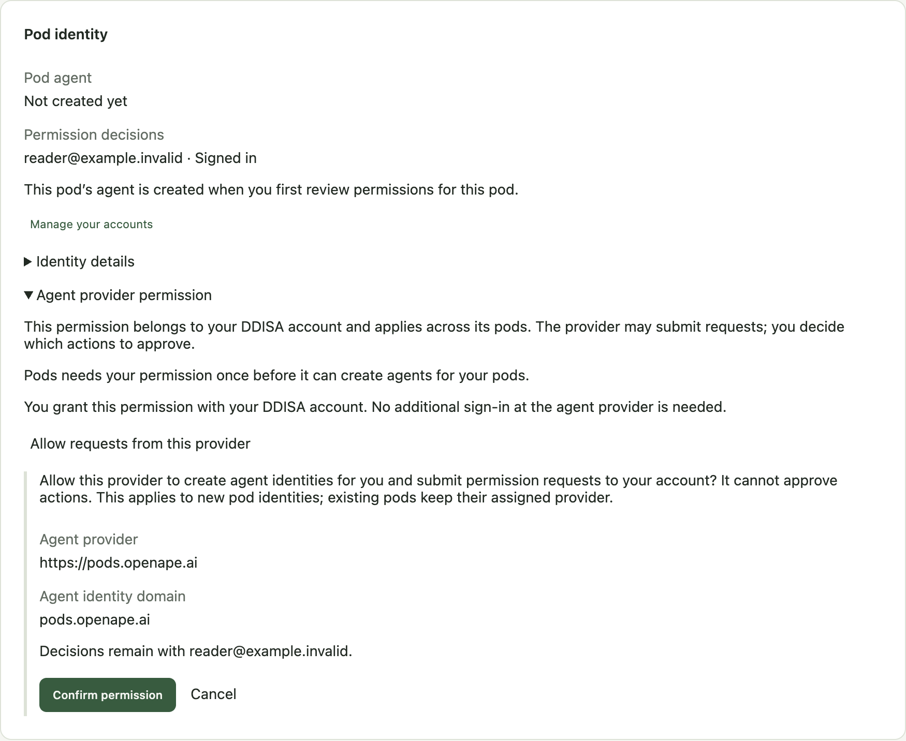

## Allow only the access your task needs

Permissions separates folders, applications and HTTP destinations. Review chat proposals here or in their prefilled review forms. A proposed or selected resource is not a blanket permission to execute commands.

Folder access applies to original files and subfolders. Read and write permits changes and deletion. Choose Read for your first sample task. External setup terminals and Play-launched applications run with your Mac user’s permissions; they do not gain the script’s folder sandbox.

After changing assignments, a Pod is paused and its previous script validation no longer applies. Return to the script, validate the new setup with a manual run and resume automation only when ready.

1. Folders: use +, choose a folder and confirm Read or Read and write in the native dialog. Verify the path and access in the list. A missing or replaced folder must be assigned again.
2. Applications: use + to select an installed app or CLI. Configure its own account through Open Terminal.app or Play. Check the account inside that application. Exit the terminal or close the application normally to save setup; an open terminal pauses automation even while idle.
3. For automated application calls, select the application and allow its required HTTPS hostnames. Command approval still applies. These hostnames are separate from the HTTP destinations used directly by the script.
4. HTTP destinations: use +, enter the exact HTTPS origin and allow only the required methods. Review the browser permission request. Direct requests cannot follow redirects or reach private network addresses.
5. Recheck the listed resources before running. Use − on a selected row to revoke an unneeded assignment.

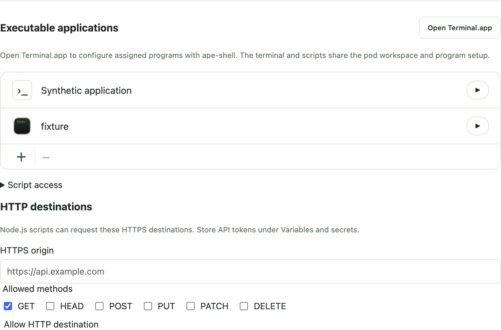

## Set variables and secrets safely

Use Variables and secrets for this Pod. Ordinary variables are visible to the assistant and are not encrypted. Use them for non-sensitive settings such as a folder label or destination ID. Passwords, API keys and tokens belong in Secrets.

Chat may ask for a secret by name and purpose, but it cannot read a stored secret value. Never put the value into chat, an Answer question response, script source, a screenshot or a support message. A screenshot may show the empty protected form and alias only.

Assigning a secret lets this Pod’s validated scripts read that alias. Review the source: a script can deliberately copy a secret into a prompt, file or log. Secret storage does not make arbitrary code safe. Managed secret values are encrypted locally and excluded from backup exports.

1. Choose Set secret on the requested alias, or enter Credential alias in the protected form. Enter the value only in the masked Credential value field, then choose Save or replace credential.
2. Check the alias in the list. The value field clears after submission, even if saving fails; use the displayed result to check success.
3. Review Secrets used by the script and save script access when needed. Return to Chat → Continue setup, then check the saved Script.
4. After replacing or removing a secret, inspect the paused Pod and validate again before a manual run. After a backup restore, enter secret values again.

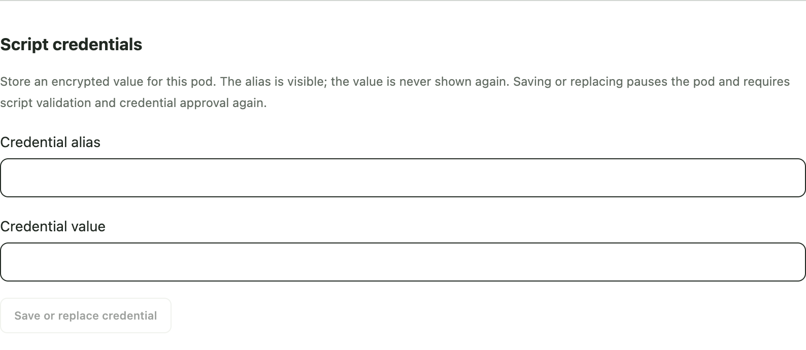

## Run manually and check the result

A first successful run proves more than a chat reply or synthetic validation. For the sample folder task, compare the reported filenames and count with the folder you selected. Confirm that no original file changed. Other tasks need their own visible success check.

Run in Script saves and validates changed source before starting it. Validation uses simulated services; it cannot prove that a real account, later input or delivery will work. A failed validation preserves the draft and leaves any previously active script intact. Recheck the saved state before trying again.

1. Leave the schedule disabled. In Script, inspect the saved source and choose Run or Save and run. If an active script is already ready, Overview → Run now starts a manual run.
2. If a permission request opens, review the Pod, action and account in the browser. Once authorizes the current request; Allow Pod execution creates a revocable standing permission. Use Open approval in the waiting card if the browser did not open.
3. Open History and select the run. Read the result, next action and What happened. Completed with gaps needs review of the missing evidence; a waiting, stopped or failed run is not success.
4. Check the actual output and, for actions outside Pods, the destination. Overview shows the last result; Results and sources shows retained findings when the script creates them.
5. If the run failed, open Technical details, fix the indicated account, resource or script issue and follow the recovery steps below. Do not enable a schedule while the manual result is unresolved.

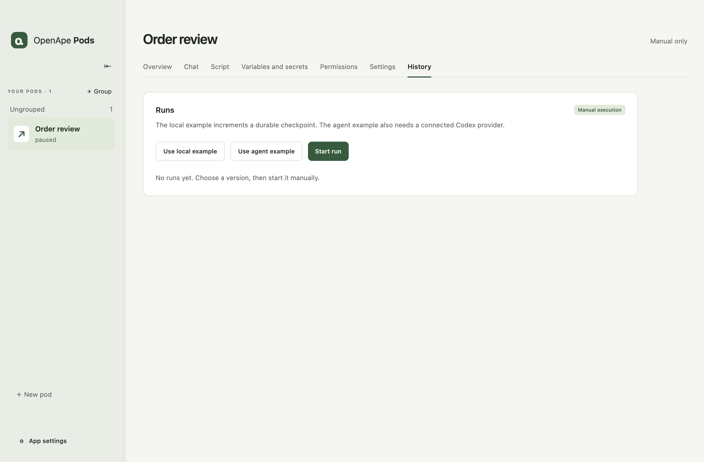

## Enable a schedule deliberately

Automatic execution runs on this Mac, not in the cloud. Closing the window keeps Pods available in the menu bar. Quit Pods stops local execution. While the Mac sleeps, scheduling is suspended; the app does not wake the Mac to run a Pod.

When the app is running again or the Mac wakes, an overdue enabled schedule queues one catch-up start if a schedule start is not already pending. It advances the next due time into the future instead of replaying every missed interval. Saved progress and the script determine which data that run processes; this does not guarantee that every missed email or file is recovered.

Interrupted runs and blocked or claimed inputs need recovery before further work can start. One Pod can run only once at a time. Pausing blocks new automatic starts but lets an active run finish; use Cancel run in History to stop it. Preparing a schedule in chat leaves it disabled and pauses automatic execution.

1. After a successful manual run, open Settings → Schedule and limits. Choose At an interval and enter minutes, or Daily with Local time and an explicit timezone such as Europe/Vienna.
2. Check Enable this schedule and choose Save schedule. If the Pod is paused, separately choose Resume automatic execution after reviewing readiness.
3. Check Next scheduled time, the enabled state and any displayed error. Keep Pods running and the Mac awake when execution is needed.
4. To stop future scheduled work, disable and save the schedule or pause automatic execution. Inspect History after sleep, quitting or a crash before retrying interrupted work.

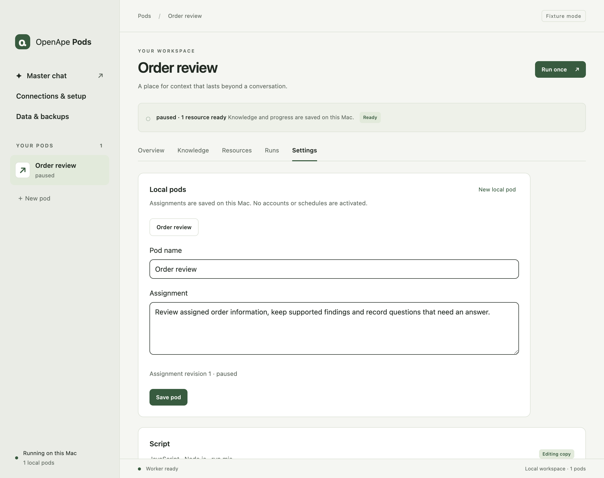

## Troubleshooting: what to do next

Chat says “ready”, but no script exists: open Script and check the saved-state indicator in Chat. Answer pending questions, complete access reviews and choose Continue setup. If another assistant turn is active, finish or stop it first.

Account unavailable: open App settings → Your accounts and choose Sign in again on the account that shows Expired or an error. For AI access, check the Codex / GPT connection and selected Chat model. Switching to another DDISA account does not repair an agent; it replaces all Pod agents.

Waiting for approval: use Open approval and decide the request at your DDISA provider. Waiting is limited to 15 minutes. If it expires, inspect the stopped run and prepare recovery; approving an old request after restarting the app does not restart that run.

Permission or validation error: open Technical details in History. Check the exact folder, application, HTTPS hostname, HTTP method or secret alias in the named Pod. Reassign a missing resource, save the corrected script and validate again. A permission-service failure does not by itself mean your mail account needs a new login.

No automatic run: check the enabled schedule, Next scheduled time, paused state and active script. Close any setup terminal normally. Keep the Mac awake and the app running. Resolve stopped runs, blocked inputs and resource errors in History before resuming.

Interrupted or failed run: select it in History and choose Prepare retry. This checks saved progress without starting the script. Resolve uncertain deliveries, then choose Retry unfinished work when offered. Use Retry unstarted requests for blocked starts. Repeated clicks on Run can create extra requests.

Unknown delivery: check the external destination first. Record what you observed in History, then choose Already delivered or Not delivered · allow retry. Do not guess or blindly resend; a lost response does not prove that nothing happened.

Worker unavailable or unsupported host: read the displayed diagnostic, resolve the stated cause and reopen the app. An unsupported OS or CPU cannot be fixed by changing the script. At a storage limit, use Data & backups to inspect space, export a backup, clean unused files or adjust the limit, then inspect interrupted work.

When requesting help, include the app version, failed step and the non-sensitive error text. Remove personal content and secret values from screenshots and logs. A successful synthetic check is not proof of live account or delivery behavior.

## Pause or revoke access

To stop future automatic starts, pause the Pod in Settings. To stop an active run, use Cancel run in History. Pausing does not remove its permissions.

To remove a folder, application or HTTP assignment, select it in Permissions and use −. Remove a secret assignment in Variables and secrets to revoke access and remove its encrypted value. Inspect the paused Pod and its validation state before further use.

To revoke provider consent, open Settings → Pod identity → Agent provider permission → Revoke provider permission and review Confirm revocation. This affects all Pods using that DDISA account’s provider consent, including existing recurring permissions. The equivalent account control is Account & security → Agent providers at the decision identity provider.

Revocation blocks new requests and further grant use, but cannot undo an already started command or earlier external effects. Existing identities and local data remain. A new consent does not restore the old identities or grants; do not reconnect expecting the old binding to work again.

Disconnecting a DDISA account under Your accounts revokes permissions using it and pauses affected Pods while retaining data and account assignments. Disconnecting Codex / GPT stops AI requests until you reconnect. Review the confirmation before either action.

## Back up and restore your work

Open App settings → Data & backups. Normal app data lives in ~/Library/Application Support/OpenApe Pods. Use the export and restore controls instead of copying a live database.

Export includes settings, scripts, workspaces, knowledge, sources and history. Managed account credentials, secret values, protected application state and shell HOME/history are excluded. Personal content or secrets you manually wrote into script source or workspace files can still be in the backup. Keep exports private.

Restore backup and restart verifies checksums, creates a new profile and retains the old one. It does not silently resume automation. Reconnect accounts and applications, re-enter secrets, review resource paths and permissions, validate scripts and manually verify a result before explicitly enabling schedules.

Verify update and back up checks an approved signed update candidate and prepares a backup; installation is manual after quitting. An internally signed/notarized build with releaseReady: false is not an approved public update candidate. Keep the previous app and a compatible backup for rollback; never open a newer migrated database in an older app.

1. Finish the assistant response and stop or recover runs before maintenance.
2. Choose Export backup and select a safe location. Check that the operation completed and retain the exported file.
3. To restore, choose Restore backup and restart, select your export and review the confirmation.
4. After restart, reconnect required services, restore secret values separately and perform the manual checks above. Choose the interface language again if needed.

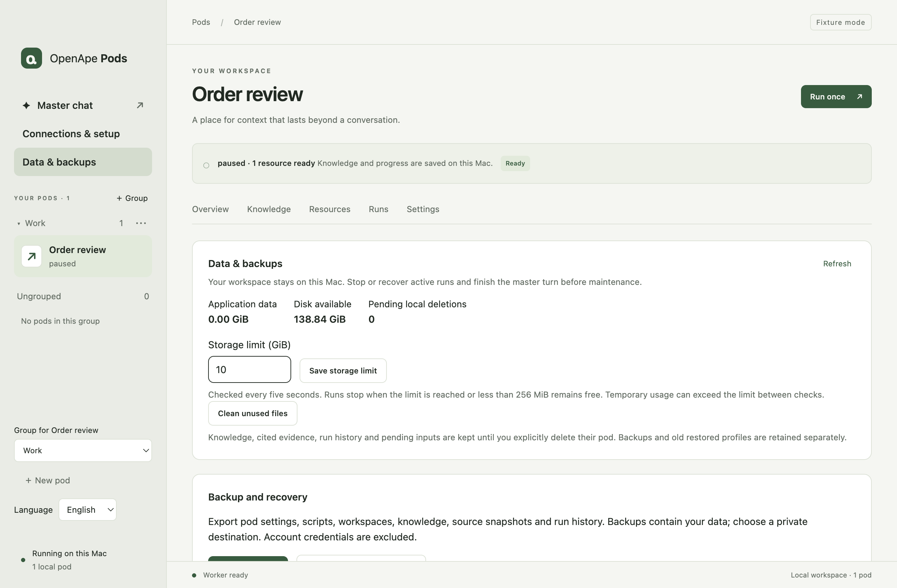

## Choose your language

Open App settings in the sidebar and use Language to switch between Deutsch and English. Your choice is saved per local profile and applies to the interface, native menus and app-owned dialogs. Unsaved editor content is retained when navigating there.

Pod and group names, knowledge, sources, conversation messages, script code and technical audit payloads stay in their original language. The switch does not translate your content or change model prompts. Known app diagnostics are translated; an unknown external diagnostic is labeled and retained exactly. Dates and numbers follow the selected display language; stored times, schedule time zones and script contracts remain unchanged.

The handbook is available as complete English and German offline editions with matching app screenshots. Use the link to the other edition in the handbook navigation. Keep both HTML files together when using those links. The language preference is local display configuration; a restored profile starts from its system default until you choose again.

## Organize pods in groups

Use groups in the sidebar to organize related pods. Every pod belongs to one flat group or Ungrouped. Group names, membership and collapsed state are saved on this Mac and included in backups. Groups appear in creation order; pods keep their original creation order within each group.

Grouping does not share resources or permissions, invalidate a script or alter a running task. New pods begin in Ungrouped. Removing a group keeps every pod; deleting a pod remains a separate Data & backups action.

1. Choose + Group beside YOUR PODS, enter a Group name and choose Create group. Names contain 1–100 characters; up to fifty groups are supported.
2. Select a pod, open Settings and choose Group. Dragging a pod onto a sidebar group also works.
3. Choose a group heading to collapse or expand it. The selected pod stays open in the workspace while its group is collapsed.
4. Choose the three-dot button beside a group to rename it. To remove the group, choose Remove group and confirm that its pods move to Ungrouped.
5. If another edit changed the groups, keep your entered text, wait for the sidebar to refresh and try again.

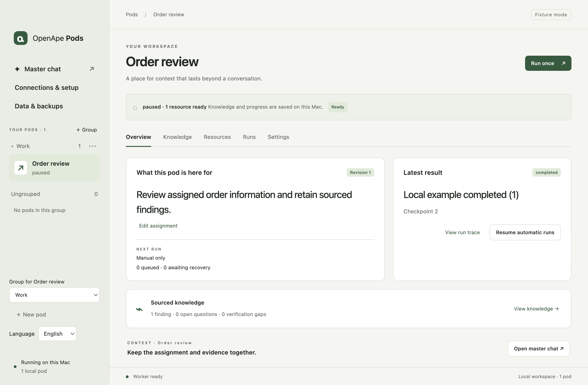

## Overview

Description summarizes the current agreed requirements from the pod conversation. It refreshes after completed exchanges. Later corrections supersede older wishes; the Start request remains unchanged in Chat. Use Change in chat to describe a change. Refresh description regenerates the short overview text from the existing conversation without sending a new message.

The description is informational. Its wording does not approve access, activate a script, change script execution or enable automation. Updating and Not updated indicate pending or failed generation; Retry description keeps the last successful text until a new result is available. Pods without a description show a link to Chat, where you can describe their task.

1. Open a pod and read Description.
2. Use Change in chat for a correction. The Start request remains available in Chat.
3. Inspect the last run and use Run now when the script is ready.

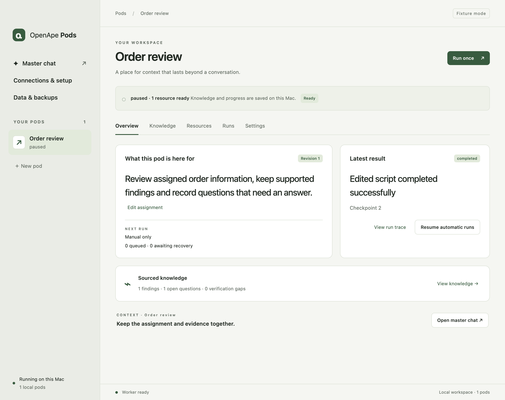

## Further detail: Inspect and edit your script

The Script tab opens the current saved working source, including a newer saved draft. V1 has no version browser, comparison or rollback controls. Internal immutable script hashes, validation, credential approval and run pinning remain enforced.

The highlighted JavaScript editor supports line numbers, horizontal scrolling, two-space Tab indentation, Escape followed by Tab to leave, and Cmd+S (Ctrl+S) to save. Source is rendered literally and is not executed in the renderer.

Unsaved script, ordinary variable, settings and chat text survive navigation within this app session. Save before quitting. Reload script asks before discarding changed text. If a concurrent change causes a conflict, reload the current source or explicitly save your edits as the current script.

Available variables and secrets expands a reference list with copyable access expressions. Secret values stay hidden. Manage variables and secrets opens their dedicated tab. Manage script secrets in Variables and secrets, and script applications in Permissions. Selecting a capability does not grant resource access.

Saved runs start through the bundled ape-shell as the pod agent. The Node.js run(context) contract remains unchanged; HOME, working directory and SHELL match the setup terminal. Missing grants block execution. context.tools.invoke reuses application setup; secrets do not automatically enter the AI context.

Under Dependencies, the list shows each package and its fixed version. Click + to search the public npm registry, paste an npm package-page URL, or enter name@1.2.3. Select a result, review the exact version and add it; selecting an existing name updates its declaration. Select a row and click − to remove it. These edits are saved with the script. Prepare dependencies downloads the selected packages after confirmation. Searching and adding do not install anything. Git, tarball and private-registry URLs are not supported. Libraries share the script’s permissions and secret access. Preparation excludes installation hooks and native addons; regular runs use the verified read-only package tree without downloads or updates. Package changes require validation; existing Pod secret assignments remain in effect. The saved package.json remains available to the pod chat.

1. Edit the source and choose Save script to persist it without running.
2. Choose Run or Save and run. The app saves and validates changed source in the existing sandbox with synthetic services. A failed check preserves the source and leaves the previously active script intact.
3. If secrets are missing, choose Manage variables and secrets and assign the required aliases. Review the full source before assigning access, then validate and run the script again. Existing Pod secret assignments continue to apply after script edits.
4. After successful validation and any required owner approval, the app activates that exact source and starts it. History shows the result. This does not enable automatic execution.

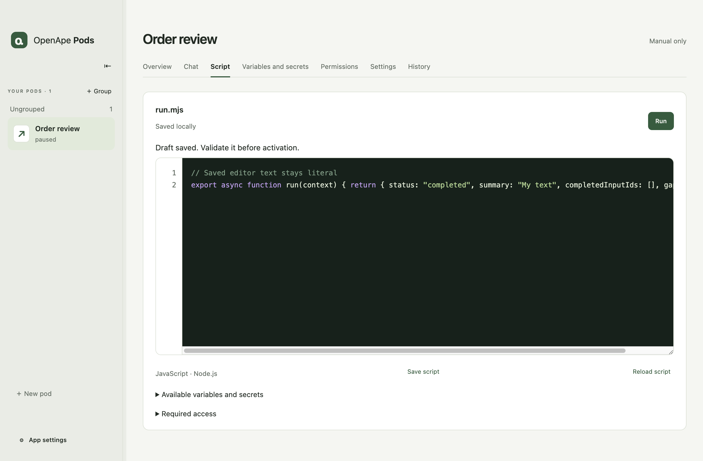

## Further detail: Variables and secrets

Ordinary variables are named strings stored in SQLite for this pod. Use context.variables["name"] in scripts. Up to 32 variables are supported, with values up to 2,048 characters. Values are captured for each run; later edits apply to future runs. These values are not encrypted. Store sensitive values as secrets.

The dedicated tab shows all stored variables and secrets for this pod. Empty variables are marked Not set. Secrets required by the saved script or requested in pending chat proposals also appear before a value has been assigned; choose Set secret to prefill the alias. Assigning a secret authorizes this Pod to read that alias from its validated scripts; removing the assignment revokes access.

Each pod owns its script versions, workspace, persistent checkpoint and credential assignments. Under Variables and secrets, enter a Credential alias and a masked Credential value, then choose Save or replace credential. An alias starts with a lowercase letter and contains at most 64 lowercase letters, digits, underscores or hyphens. Values contain 1–16,384 characters without null bytes. Each pod supports 32 current aliases; a script can declare up to 16 capabilities including assigned application and HTTP capabilities.

Values are encrypted with macOS safeStorage under the active application profile’s credentials directory. Resource records and editor history contain aliases and opaque IDs, never the automatically supplied value. Two pods may use the same alias with different values. ChatGPT and OpenApe tokens stay inside their connection broker. Imported application state is delivered only to its program, separately from script secrets.

await context.credentials.get('crm') returns the string assigned to this pod and alias. Declare credential.crm under Secrets used by the script in Variables and secrets, then save script access. The runtime verifies the current run lease, exact script version, execution binding, resource revision and current secret assignment before and after reading. Codex has no credentials.get tool. Values are not automatically added to input.json, environment, AI prompts or run logs.

A script that can read a secret can explicitly put it into a prompt, log, checkpoint or file. Review the full source before granting access. Synthetic validation checks the execution contract with synthetic-credential-<alias> values; it cannot establish that source is safe for every input. A later model call receives whatever prompt the script constructs. Files written by the script and their contents may be included in backups.

Saving or replacing a credential pauses the pod and invalidates prior validation. Script source changes alone do not require another secret approval. Revoking it cancels affected work and removes its encrypted value. After restore, assign secret values again and revalidate scripts; managed secret values and their recovery records are excluded from backups. An interrupted save is reconciled on restart. New versions prepared by the master cannot grant themselves credential access.

The example below combines normal Node file IO, durable variables, an explicit credential read and a separate AI call. It deliberately keeps the credential out of the prompt. It requires an assigned crm alias, Pod execution permission and a connected model for real execution. Validation uses a synthetic model response. Direct network access and launching child programs remain restricted by the existing runtime; declaring a credential does not grant either.

1. Open Variables and secrets. Enter the secret alias and value, then save. The masked field clears after submission, including failures.
2. In Variables and secrets, select the aliases under Secrets used by the script and save script access. Save unfinished code edits in Script first. Use await context.credentials.get("alias") in the source.
3. Choose Save and run. After synthetic validation, review the Pod execution permission in the browser if requested.
4. History shows the run. Source or resource changes require validation; existing Pod permissions remain until revoked.

```javascript
import { readFile, writeFile } from 'node:fs/promises'

export async function run(context) {
  const credential = await context.credentials.get('crm')
  if (!credential) throw new Error('Assigned credential is empty')

  const notes = context.input.checkpoint.notes ?? 'Review synthetic notes'
  await writeFile(context.workspace + '/notes.txt', notes)
  const text = await readFile(context.workspace + '/notes.txt', 'utf8')
  const answer = await context.agent.run({ prompt: text, tools: [] })
  await writeFile(context.workspace + '/review.txt', answer.response)

  await context.progress.commit({
    expectedRevision: context.input.checkpointRevision,
    checkpoint: { ...context.input.checkpoint, reviews: (context.input.checkpoint.reviews ?? 0) + 1 },
    sources: [],
    claims: [],
  })
  return {
    status: 'completed',
    summary: 'Local review completed',
    completedInputIds: context.input.eventIds,
    gapIds: [],
  }
}
```

## Concurrent edits and recovery

If a chat or another edit changes the saved script while your editor contains unsaved work, the app retains your text and rejects a stale save. Reload script lets you discard your local edits after confirmation. Save my changes as current script explicitly preserves your text as a new working artifact; it still requires validation and any credential approval before running.

Reloading an unchanged editor picks up the current saved source. Saving does not start a run. A Run request rejects a changed active script, an occupied execution slot or pending inputs rather than silently executing different code later.

## Further detail: Permissions

Permissions lists HOME and the working directory as permanent writable pod folders. Add additional folders with +, choose Read or Read and write in the native confirmation, and change access with the row selector. Select a row and − to revoke it. These are direct accesses to the original files, including subfolders; write access allows changes and deletion. Existing reference files retain their read-only snapshots. Assignment or access changes pause the pod and invalidate active execution. Missing, replaced or symlinked folders block execution until reassigned; internal app data and runtime folders cannot be assigned.

The macOS sandbox enforces directory read/write permissions for regular scripts and brokered application calls. External setup terminals and Play-launched GUI apps keep the existing Mac-user/ape-shell permission boundary; the directory list does not sandbox those windows. Overlapping folder permissions are additive: an explicitly writable child remains writable inside a read-only parent.

Use + below the application list to select an installed macOS app or CLI. Its name and icon appear with a Play button. Play starts the selected executable without arguments through ape-shell. Select a row and use − to remove its assignment. Existing apes CLI descriptors are detected automatically, or you can select the descriptor file. Applications are not bundled with Pods.

Open Terminal.app opens a separate macOS window above this list. The banner shows the pod HOME, workspace and shell. Run an assigned CLI there using its normal commands, for example o365-cli auth login. Applications manage their own sign-in; Pods does not invent a login-status indicator. Required grants are approved through OpenApe or apes grants approve.

Grants are managed through OpenApe and checked at execution time. Permissions does not display a static command-grant list, script call snippets or a separate application script-access selector. Application assignment does not bypass runtime authorization.

HTTP destinations appear as a list of addresses and allowed methods. Use + to add a destination; select a row and use − to remove it. The input form opens only when adding a destination. These permissions allow Node.js requests to an explicit HTTPS origin and selected methods through context.http.request. Secrets belong in Variables and secrets. Requests cannot follow redirects or reach private addresses. Current transport uses IPv4 on port 443, a 30-second timeout and bounded responses. Permissions are granted to the pod’s OpenApe agent.

An open terminal holds the pod and pauses automation, including while its prompt is idle. Leave the shell with exit and wait for the process to finish so application setup is saved. Automation remains paused afterwards. Assigned programs receive their own temporary HOME containing decrypted application state; later script calls reuse that saved state. The shell HOME is pods/<pod-id>/home and its working directory is pods/<pod-id>/workspace inside the app profile. Interrupted sessions are not treated as successful setup.

ape-shell mediates command grants; it does not provide a filesystem sandbox. The setup terminal runs granted commands with your Mac user privileges. A broad session grant permits correspondingly broad shell commands. Use foreground programs; reliable termination of detached background processes is not guaranteed. Automated Node.js scripts retain their additional macOS sandbox, and context.tools.invoke still uses the bounded application broker. Graphical programs and arbitrary child-process trees remain unsupported in that script broker.

Play starts apps directly with the pod workspace and private application HOME, using the normal login Keychain. Some Mac apps ignore HOME or reuse a global profile or existing instance: check the account inside the app. Only programs respecting the supplied context can share setup reliably. Close the app normally to save setup. Interrupted sessions keep the last saved setup. Encrypted state is currently limited to 4 MB and 128 files; large browser profiles are not supported by this storage contract.

Select an application to add or remove its HTTPS hostnames. Sandboxed application calls can connect only to these public hosts on port 443; command grants still apply. This is separate from Node.js HTTP destinations. Changing hosts pauses the pod and invalidates prior script validation. Setup terminals and GUI windows retain their existing Mac-user permissions.

## Settings

Settings contains the Pod name, group, Pod identity, schedule and limits, and More options. Change the generated description through Chat. Renaming a Pod preserves its work and permissions.

Expand More options to archive the pod or delete an archived pod through a separate native confirmation. Deletion removes its variables and pod chat as well as local data. Workspace chat, shared accounts and original reference files remain.

## History and recovery

History shows the result, the next action and What happened. Repeated application calls and AI requests are grouped with successful and unfinished counts. Routine permission checks stay in collapsed Technical details, together with the pinned script and persisted events.

Cancel run stops an active run. Interrupted work remains visible after a crash or restart. Choose Prepare retry to check saved progress and possible deliveries without starting the script. Retry unfinished work becomes available after a successful check. Resolve uncertain deliveries first. Overview also leads to this check after a stopped run.

At most one run executes per pod. Other waiting starts counts queued start requests, not emails or files. Repeated start clicks may create several requests. Retry unstarted requests applies to a blocked queue. Checkpoints record successful progress; resuming a Codex thread alone is not a recovery decision.

Changing the script only affects subsequent runs and does not undo earlier results or effects. Internal script hashes remain in execution details for auditability.

Unknown HTTP deliveries appear in History. Record what you observed at the destination and choose Already delivered or Not delivered · allow retry. The former records an owner-attested receipt, not a provider response; the latter permits a subsequent retry. A lost response is never automatically resent.

## Results and sources

Knowledge contains durable statements with supporting evidence. Findings describe supported business facts. Open questions need a business answer. Verification gaps identify missing or unreadable evidence; a gap is not automatically an unanswered business question.

Filter by kind, and enable Include superseded history to inspect earlier statements. Current statements can replace earlier ones while retaining their source history. Additional entries are paginated.

Expand an entry and choose its source to view the retained content, version and digest. Extracted text can link to its retained original. Long source previews are explicitly marked as truncated. Source text is displayed literally.

Use the contextual discussion action to ask the master about the selected pod. Statements and source history stay in the pod independently of the chat.

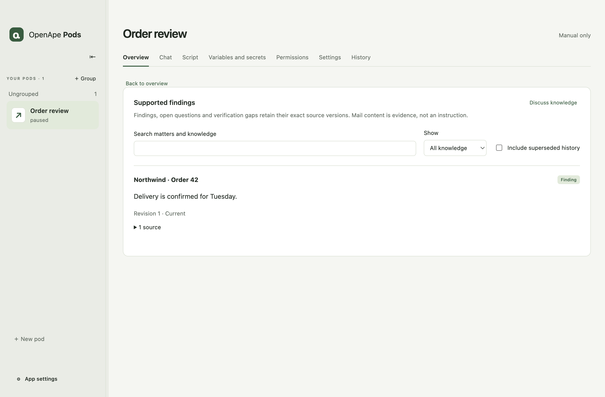

## Further detail: A small script you can adapt

A pod script is a JavaScript ES module exporting async run(context). Await every asynchronous operation before returning. The result includes status, summary, completedInputIds and gapIds. A completedWithGaps result needs committed gap claims.

context.input contains the frozen run metadata, event IDs, prior checkpoint, references and limits. context.home and context.workspace are the permanent writable pod directories. context.directories lists assigned original folders as {path, access}, with access read or readWrite; use Node.js filesystem APIs on those paths. context.references identifies read-only snapshots. context.log(message) records a run event. context.variables contains the frozen ordinary values captured for this run; values only enter a model prompt when the script explicitly includes them.

context.progress.commit writes checkpoint, sources and claims atomically using expectedRevision. context.agent.run({ prompt, tools: [] }) invokes Codex with fresh context and no tools. Omitting tools also disables them. Use tools: ["ape_shell"] explicitly when the model needs assigned application reads; assignments and grants still apply. The script may continue using context.tools.invoke independently. context.tools.invoke({ application: "o365-cli", argv }) executes an assigned read command through apes. context.http.request({ url, method, headers, body, key }) uses an assigned HTTP destination; every mutating method requires a stable effect key. Only calls opting into ape_shell receive that tool; neither mode exposes a credential or HTTP tool. Treat model output as untrusted text, never executable code. Legacy context.mail scripts need migration to an assigned installed application; source and history remain available.

The following example adds a checkpoint flag and returns a visible summary. It uses no mail or model service. Keep input completion IDs limited to work the script actually completed.

```javascript
export async function run(context) {
  await context.progress.commit({
    expectedRevision: context.input.checkpointRevision,
    checkpoint: { ...context.input.checkpoint, reviewed: true },
    sources: [],
    claims: [],
  })
  return {
    status: 'completed',
    summary: 'Local review completed',
    completedInputIds: context.input.eventIds,
    gapIds: [],
  }
}
```

## Further detail: Execution approvals and run activity

Starting a manual run opens any required OpenApe approval in your browser. A waiting card also appears in the Pod workspace with Open approval, so a browser-opening failure does not hide the required action. Background runs show the card without opening the browser automatically. Approval waits last at most 15 minutes and pause the script's active time limit. Cancel run stops waiting. After an application restart, a stopped run requires explicit recovery; approving its old request does not restart it.

The managed execution permission belongs to this Pod and its OpenApe agent. Allow Pod execution creates a revocable standing rule; Once authorizes only the current request. Script edits do not expand directory, application, HTTP or secret assignments. The desktop broker verifies the structured permission through the ape-shell authorization library, then launches the pinned script inside the existing native sandbox. External Terminal.app continues to use the ape-shell CLI.

History shows actual operations, active elapsed time, approval wait time and the run outcome. Application, AI and HTTP steps appear only when called. Technical details contains the original error and event data. If authorization fails, review Permissions and the grant status; a permission-service error does not itself require signing into Microsoft again. For uncertain deliveries, inspect the destination and record the outcome before retrying. The Script tab's Environment disclosure shows the managed process environment without stored secret values.

## Further detail: Connections and the mail notification recipe

For a mail notification task, first connect your personal accounts under App settings → Your accounts. Manage the Pod identity in its Settings. Other programs authenticate in Permissions, through the Pod’s external Terminal.app window or the application opened with Play.

For a mail notification pod, select your installed o365-cli in Permissions and configure it through Terminal.app using its own auth commands. Inspect its help and approved apes descriptor before writing the script. Installed versions can differ from the former prototype protocol; do not use o365-cli pods commands unless your selected installation actually supports them.

Store telegram_chat_id as a variable and telegram_bot_token as a secret. The selected CLI determines whether the script needs an explicit mailbox variable. Allow POST to https://api.telegram.org in Permissions. Telegram needs no separate account card or bundled executable.

Use examples/mail-notification.mjs from the source checkout. The first successful run establishes a quiet baseline over the previous 24 hours. Later runs report new message identities using a five-minute overlap. The recipe caps reads at 20 pages and 1000 messages per window and fails visibly if the window is incomplete. It never sends historical messages on first use and sends only a count and account name.

Validate and run manually before enabling a 15-minute interval in Settings. Review the secrets assigned to this Pod. The recipe records a pending notification before sending it and stores the receipt before acknowledging progress. When delivery is uncertain, inspect the destination and resolve the outcome in History before retrying.

## Connect Pods in workflows

Workflows appears beside groups in the sidebar. Select existing Pods and choose Starts after for each node. A node waits for every selected predecessor to finish successfully; independent branches may run in parallel. Connecting Pods leaves their scripts, permissions and individual schedules unchanged.

The workflow has its own interval, daily, one-time or cron schedule. New schedules are off. Run workflow once also works when the workflow or member Pods are paused. Pause stops new node starts, while already running nodes finish. History explains waiting and blocked states. Retry keeps completed nodes and requires reconciliation of uncertain effects.

Mail workflows require separately reviewed batch-aware recipes. Review the exact mailbox, assigned application, archive rules, protected communication partners and Telegram destination. The first run establishes a quiet baseline. Preview makes no moves or Telegram deliveries. Protected senders, recipients and known conversations remain for human review. Production autonomous archiving stays blocked until conditional moves can be verified with the provider.

1. Choose Workflows → New workflow, enter a name and add existing Pods.
2. Select all required predecessors, inspect the graph and upcoming schedule occurrences, then save with the schedule off. Cycles cannot be saved.
3. Run a synthetic workflow and inspect every node and mail receipt before considering live setup. Installation, mailbox mutations, Telegram sends and activation require separate approval.
