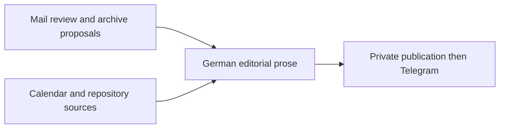

# Morning briefing workflow

Workflows were removed in issue 1455 (M4): rebuild this briefing as a network
(see `../docs/networks.md`). The description below documents the former workflow
that the scripts were written for.

Four Pods share one daily workflow schedule:

Scripts are standalone ES modules. Install each through draft, validate and
activate with its current resource assignments. Do not concatenate them or run
provider code outside the Pod sandbox. Synthetic validation without workflow
inputs only checks the initial no-work path. Actual source access and a manual
no-send workflow run are separate acceptance requirements.

| Script | Required resources | Ordinary configuration |
| --- | --- | --- |
| `mail-triage.mjs` | Existing `pods-mail`, Jev and archive integration | `delivery_mode=live`, `mail_evidence_directory` (assigned read/write) |
| `morning-sources.mjs` | Existing `o365-cli` calendar reads and `repos-issues list` with authenticated isolated state | None |
| `morning-editorial.mjs` | Agent prose, read-only access to the dedicated owner-assigned mail evidence directory | `mail_pod_id`, `sources_pod_id`, exact `mail_evidence_directory`; optional `replay_workflow_id` |
| `morning-mail-briefing.mjs` | Existing authenticated Reports HTTP and Telegram HTTP/secret | Existing delivery/publication configuration and `editorial_pod_id` |

Mail and sources have no predecessors; editorial depends on both; publication
depends only on editorial. Enable handoff on every node. Keep the existing mail
approval polling schedule; disable independent source, editorial and sender
schedules. The mail poll never runs prose generation, and manual mail runs never
consume archive approvals.

Mail emits `morning-mail-evidence/v1`, a reference to an exclusive immutable
snapshot named by workflow UUID with date, collection time, byte count and
SHA-256 digest. Editorial verifies its assigned directory, canonical path,
size, digest, date, freshness and workflow identity. Calendar/Issues emits
`morning-sources/v1`. A required source failure stops that node; partial mail
coverage remains visible in the resulting report. No raw evidence is put in the
small mail checkpoint or the 64 KiB workflow handoff.

The editor saves an assembled `morning-editorial-input/v1` snapshot before model
calls. Only generated German summaries, eligible next actions and overview are
accepted. Subjects, URLs, dispositions, calendar facts and issue metadata stay
source-controlled. Incomplete conversations cannot create an action. Every
conversation appears once; next actions remain beside the relevant email.
Generated content is data rendered by the existing controlled Reports template.

For a standalone replay, set `replay_workflow_id` to an exact previously saved
workflow UUID and run only the editor manually. It retains the original date,
writes `editorial-preview-<runId>.json` locally and neither reads providers nor
publishes a workflow output. Remove the replay variable afterward.

The `morning-editorial/v1` output binds date, workflow, preview mode and digest.
The existing sender validates those fields, fixes its own destination series and
freezes the exact payload before publication. Keep the sender identity,
checkpoint and effect ledger during migration. Its pending-operation gates,
daily idempotency key, publication read-back and Telegram receipt handling are
unchanged. Do not retry uncertain effects or overwrite a dated edition.

Cut over only after the native PR checks pass and source authentication is ready.
Use a distinct owner-private migration preview series when today's normal
preview edition already exists. Manual preview must not send Telegram. Restore
the normal preview series afterward. Record real run IDs and receipts separately
from tests and from future scheduled delivery. Roll back by restoring prior
validated scripts and workflow definition through native APIs, without changing
checkpoints or delivery effects.
