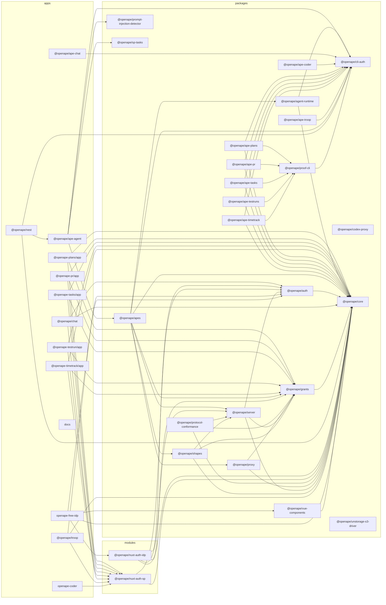

# Internal dependency graph

> Generated by `pnpm graph` (`scripts/dependency-graph.mjs`) — do not edit by hand.
> Shows the `@openape/*` workspace dependencies between packages, modules and apps.

