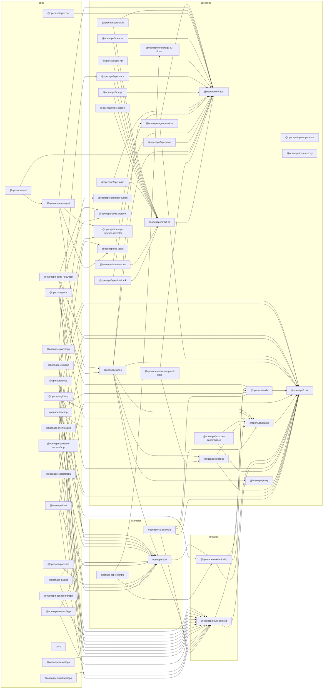

# Internal dependency graph

Generated by `pnpm graph`; validate with `pnpm docs:check`.
Includes packages, modules, apps and examples. Arrows point to dependencies.

```mermaid
graph LR
  subgraph packages
    w12["@openape/agent-runtime"]
    w14["@openape/ape-calls"]
    w16["@openape/ape-crm"]
    w17["@openape/ape-kpi"]
    w18["@openape/ape-plans"]
    w19["@openape/ape-pr"]
    w20["@openape/ape-secrets"]
    w21["@openape/ape-tasks"]
    w22["@openape/ape-testruns"]
    w23["@openape/ape-timetrack"]
    w24["@openape/ape-troop"]
    w25["@openape/apes"]
    w26["@openape/apes-openclaw"]
    w27["@openape/attention-events"]
    w28["@openape/auth"]
    w30["@openape/cli-auth"]
    w31["@openape/codex-proxy"]
    w32["@openape/core"]
    w33["@openape/grants"]
    w37["@openape/openclaw-grant-gate"]
    w40["@openape/pods-protocol"]
    w41["@openape/prompt-injection-detector"]
    w42["@openape/proof-cli"]
    w43["@openape/protocol-conformance"]
    w44["@openape/proxy"]
    w45["@openape/shapes"]
    w46["@openape/sp-tasks"]
    w48["@openape/unstorage-s3-driver"]
  end
  subgraph modules
    w35["@openape/nuxt-auth-idp"]
    w36["@openape/nuxt-auth-sp"]
  end
  subgraph apps
    w0["@openape-crm/app"]
    w1["@openape-dashboard/app"]
    w2["@openape-git/app"]
    w3["@openape-monitor/app"]
    w4["@openape-plans/app"]
    w5["@openape-pods-relay/app"]
    w6["@openape-pr/app"]
    w7["@openape-question-service/app"]
    w8["@openape-secrets/app"]
    w9["@openape-tasks/app"]
    w10["@openape-testrun/app"]
    w11["@openape-timetrack/app"]
    w13["@openape/ape-agent"]
    w15["@openape/ape-chat"]
    w29["@openape/chat"]
    w34["@openape/nest"]
    w38["@openape/pods"]
    w39["@openape/pods-ios"]
    w47["@openape/troop"]
    w49["docs"]
    w51["openape-free-idp"]
  end
  subgraph examples
    w50["openape-e2e"]
    w52["openape-idp-example"]
    w53["openape-sp-example"]
  end
  w0 --> w32
  w0 --> w36
  w1 --> w36
  w2 --> w32
  w2 --> w33
  w2 --> w36
  w2 --> w50
  w3 --> w32
  w3 --> w36
  w4 --> w18
  w4 --> w36
  w4 --> w50
  w5 --> w28
  w5 --> w32
  w5 --> w40
  w5 --> w50
  w6 --> w36
  w6 --> w50
  w7 --> w36
  w7 --> w46
  w7 --> w50
  w8 --> w32
  w8 --> w36
  w9 --> w36
  w10 --> w36
  w10 --> w50
  w11 --> w36
  w12 --> w30
  w12 --> w32
  w13 --> w25
  w13 --> w30
  w13 --> w41
  w13 --> w46
  w14 --> w30
  w14 --> w42
  w15 --> w30
  w16 --> w30
  w16 --> w42
  w17 --> w30
  w17 --> w42
  w18 --> w30
  w18 --> w42
  w19 --> w30
  w19 --> w42
  w20 --> w30
  w20 --> w42
  w21 --> w30
  w21 --> w42
  w22 --> w30
  w22 --> w42
  w23 --> w30
  w23 --> w42
  w24 --> w30
  w25 --> w12
  w25 --> w30
  w25 --> w32
  w25 --> w33
  w25 --> w44
  w25 --> w45
  w25 --> w50
  w28 --> w32
  w29 --> w32
  w29 --> w36
  w29 --> w50
  w33 --> w32
  w34 --> w13
  w34 --> w30
  w35 --> w28
  w35 --> w32
  w35 --> w33
  w36 --> w28
  w36 --> w32
  w37 --> w30
  w37 --> w45
  w38 --> w25
  w38 --> w32
  w38 --> w33
  w38 --> w40
  w39 --> w50
  w42 --> w30
  w43 --> w32
  w43 --> w33
  w44 --> w32
  w45 --> w32
  w45 --> w33
  w47 --> w27
  w47 --> w32
  w47 --> w36
  w47 --> w41
  w47 --> w50
  w50 --> w35
  w50 --> w36
  w51 --> w28
  w51 --> w32
  w51 --> w33
  w51 --> w35
  w51 --> w50
  w52 --> w35
  w52 --> w48
  w52 --> w50
  w53 --> w28
  w53 --> w32
  w53 --> w33
  w53 --> w36
```
