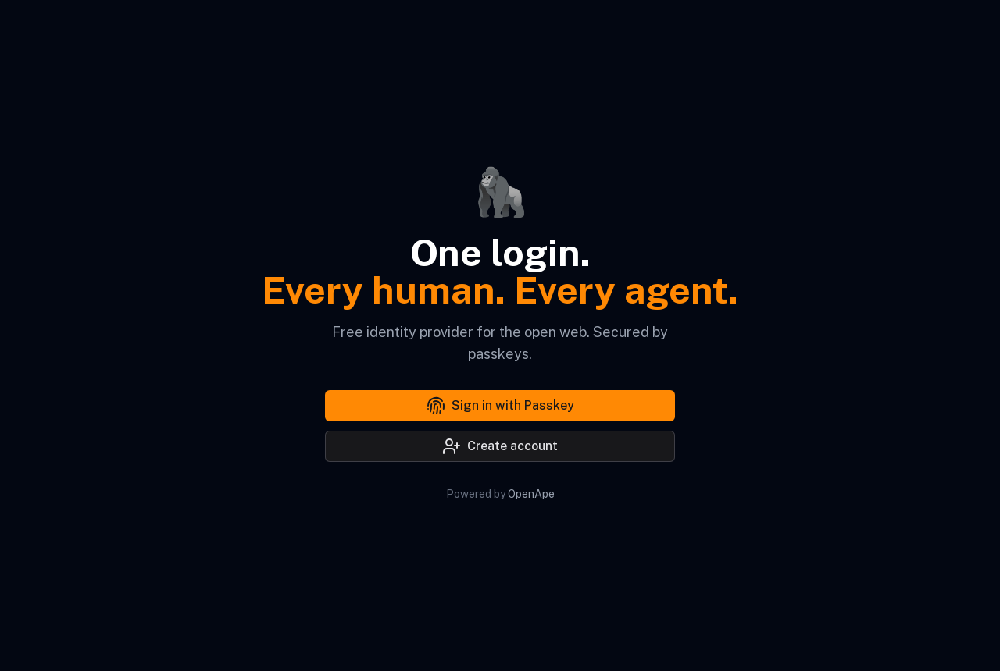
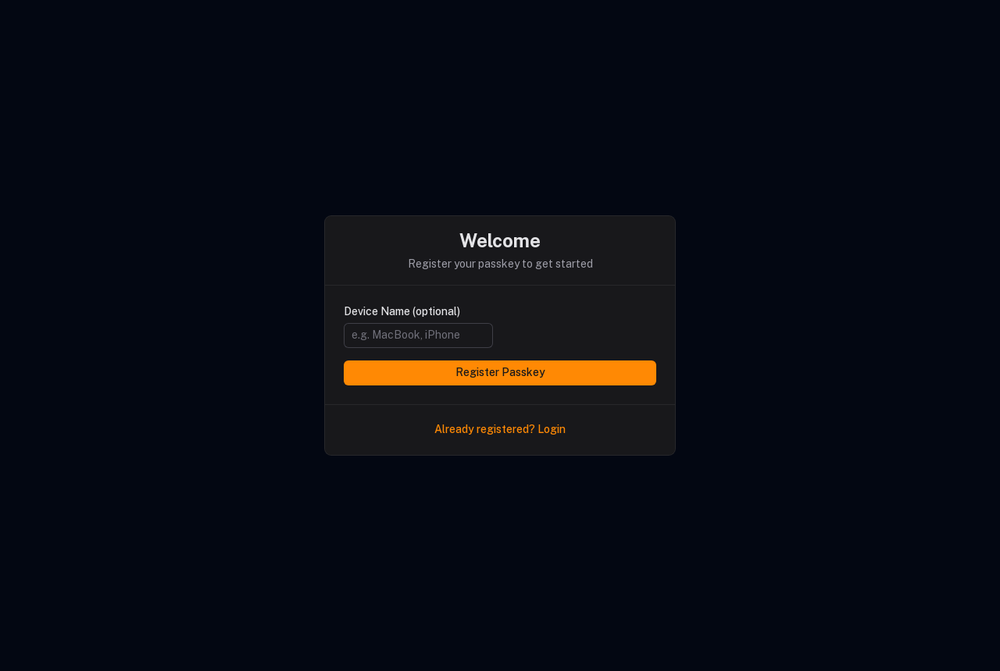
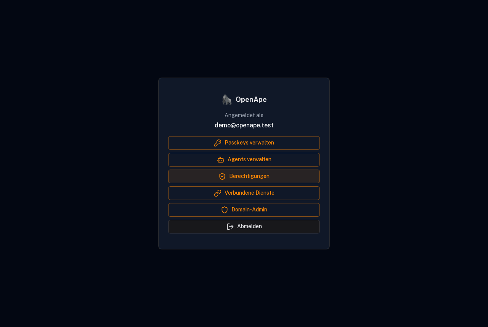
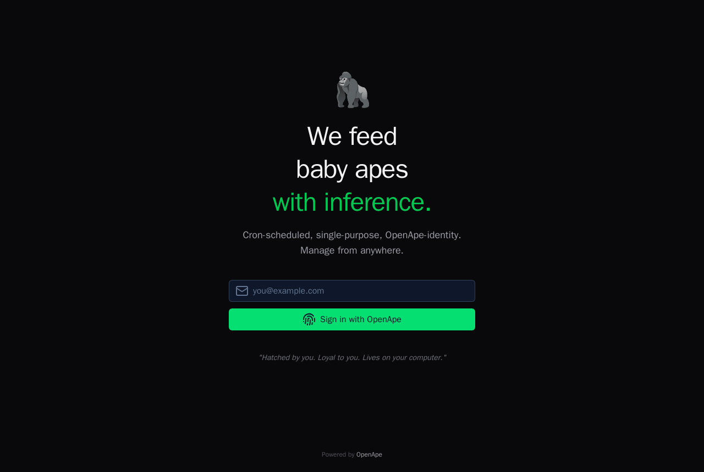
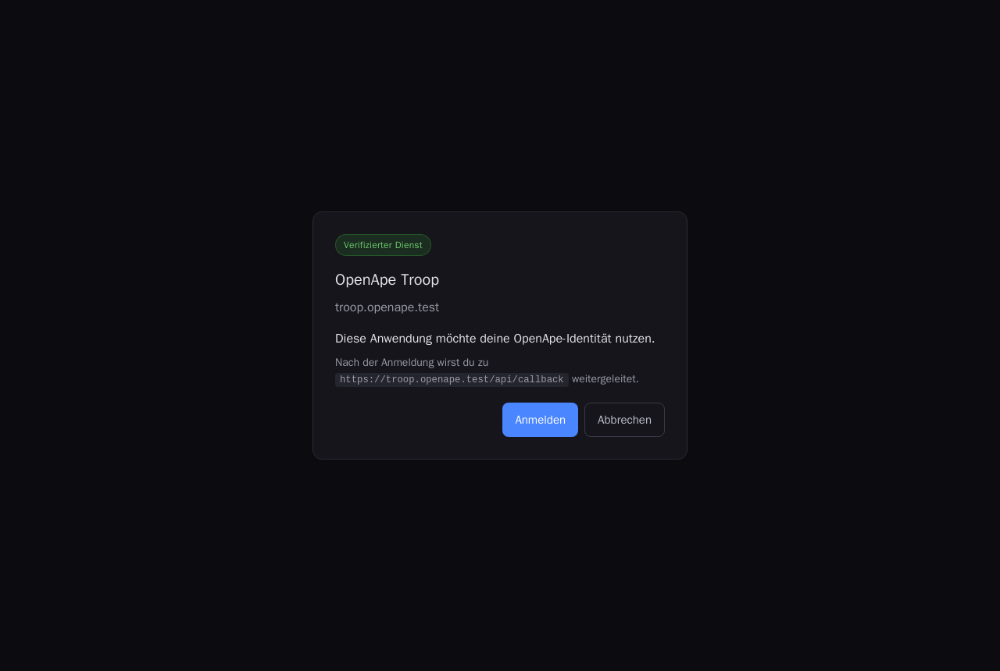
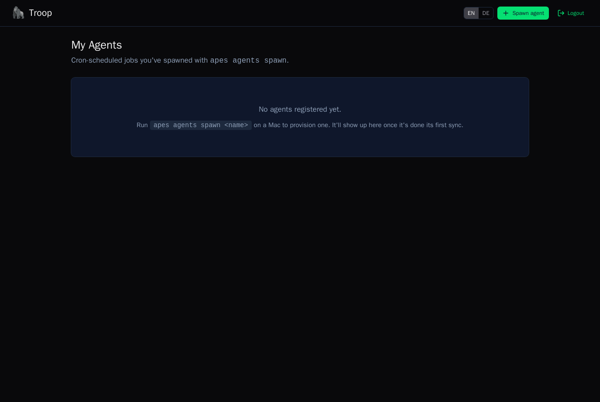
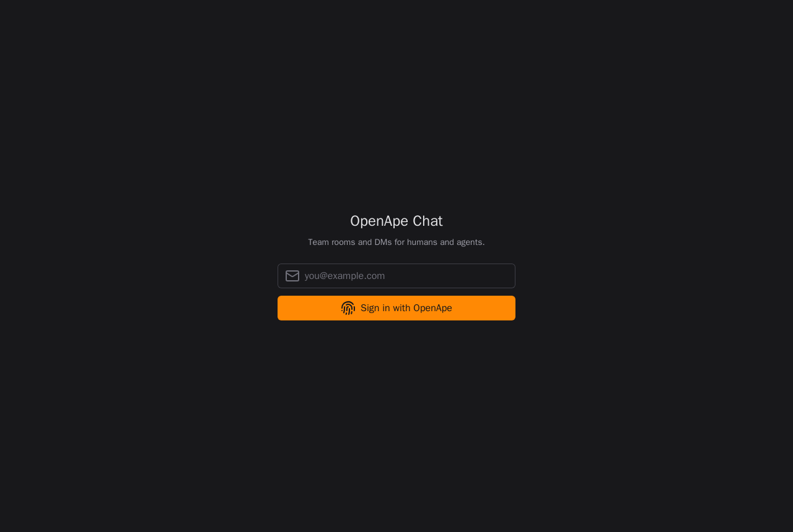
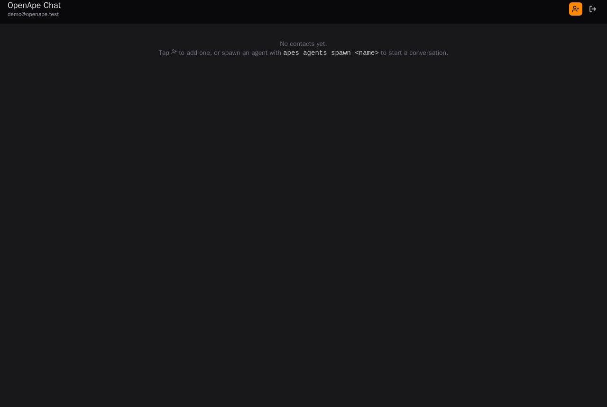

# Local Containerized Test Stack

The whole OpenApe web topology — the DDISA **IdP** plus two **SP** apps — running
locally in Docker under real `https://*.openape.test` hostnames, mirroring the
chatty/prod setup (subdomains, TLS, DNS-based DDISA discovery). A headless
Chromium drives three real user flows and captures the screenshots below.

> Everything here is generated by the tests — `compose/demo/run.sh` brings the
> stack up and re-captures every screenshot in `screenshots/`.

## Run it

```sh
# Bring the stack up + capture the flows (writes screenshots/ here):
./compose/demo/run.sh

# Clean-room run (regenerates the CA + DBs from scratch first):
./compose/demo/run.sh --fresh      # or: FRESH=1 ./compose/demo/run.sh
# The agent-lifecycle runner takes the same flag:
./compose/agent/run.sh --fresh

# Tear everything down (containers + volumes; reset.sh names every profile so
# the nest/mock-llm/playwright containers don't keep the volumes alive):
./compose/reset.sh

# Or just the stack, to poke at it yourself:
docker compose -f compose/local-stack.yml up -d --build
```

> For a full clean-room pass of *both* flows, reset once then run them without
> `--fresh` (so the second runner doesn't tear down the first's stack):
> `./compose/reset.sh && ./compose/demo/run.sh && ./compose/agent/run.sh`.

To open the apps in **your own** browser, point your Mac at the stack's DNS for
the `.test` zone (one-time):

```sh
sudo mkdir -p /etc/resolver
printf "nameserver 127.0.0.1\nport 5354\n" | sudo tee /etc/resolver/openape.test
# then publish dnsmasq: add `ports: ["127.0.0.1:5354:53/udp"]` to the dns service
```

Then visit `https://id.openape.test`, `https://troop.openape.test`,
`https://chat.openape.test` (accept the local Caddy CA, or trust it once).

## Topology

| Service      | Role                                                                 | URL                          |
|--------------|----------------------------------------------------------------------|------------------------------|
| `dns`        | dnsmasq — serves the DDISA discovery TXT at `_ddisa.openape.test`     | —                            |
| `proxy`      | Caddy — TLS (own local CA) + host-routing reverse proxy              | `:443`                       |
| `idp`        | `openape-free-idp` — DDISA Identity Provider (passkeys)              | `https://id.openape.test`    |
| `troop`      | `openape-troop` — SP (agent control plane)                          | `https://troop.openape.test` |
| `chat`       | `openape-chat` — SP (chat)                                          | `https://chat.openape.test`  |
| `playwright` | headless-Chromium runner (on the same network) — captures the flows | —                            |

Real DNS, real TLS (Node trusts Caddy's CA — verification is **not** disabled),
and **real DDISA discovery**: the SPs learn the IdP from the
`_ddisa.openape.test` TXT record, and the IdP reads `mode=allowlist-user` from
the same record to drive its consent policy. No public DNS, no `id.openape.ai`.

---

## Flow 1 — Passkey sign-up at the IdP

A new user registers a WebAuthn passkey (a CDP virtual authenticator answers the
ceremony headlessly) and lands on their IdP dashboard.

The IdP landing page:



Registering the passkey (`/register?token=…`, the link a real user gets by email):



Signed in — the IdP account dashboard:



## Flow 2 — DDISA SSO into Troop

The user opens an SP, which discovers the IdP **via DNS** and redirects them to
authorize.

Troop's start page (login email right there):



The DDISA consent screen at the IdP — Troop is asking to use the user's identity
(shown once, then remembered per `mode=allowlist-user`):



Back on Troop, authenticated:



## Flow 3 — One-click SSO into Chat

A second SP, same passkey + IdP session — no second passkey prompt.

Chat's start page:



Signed into Chat as `demo@openape.test` via SSO:



---

## How it's wired (notes for the next person)

- **One parameterized Dockerfile** (`compose/Nuxt.Dockerfile`) builds all three
  Nuxt apps. The build runs the modules' `prepare` (stub + `nuxi prepare`) before
  `turbo build`, and the runtime stage pins the arch-matched `@libsql/*` native
  binding (Nitro can't trace it).
- **Module runtimeConfig env names:** the apps read `NUXT_OPENAPE_IDP_*` /
  `NUXT_OPENAPE_SP_*` at runtime (the configKey-derived names) — the plain
  `NUXT_OPENAPE_*` names are only read at build time.
- **DDISA record:** lives at `_ddisa.openape.test` (the spec name) and is parsed
  as `v=ddisa1 idp=<url>; mode=<mode>` — a space between `v` and `idp`, then
  `; `-separated. `mode=allowlist-user` gives consent-once-remembered.
- **The IdP's registration email** uses Resend; locally there's no key, so
  `run.sh` reads the freshly-minted registration token straight from the IdP DB
  (the token is persisted before the email send) — standing in for the link.
